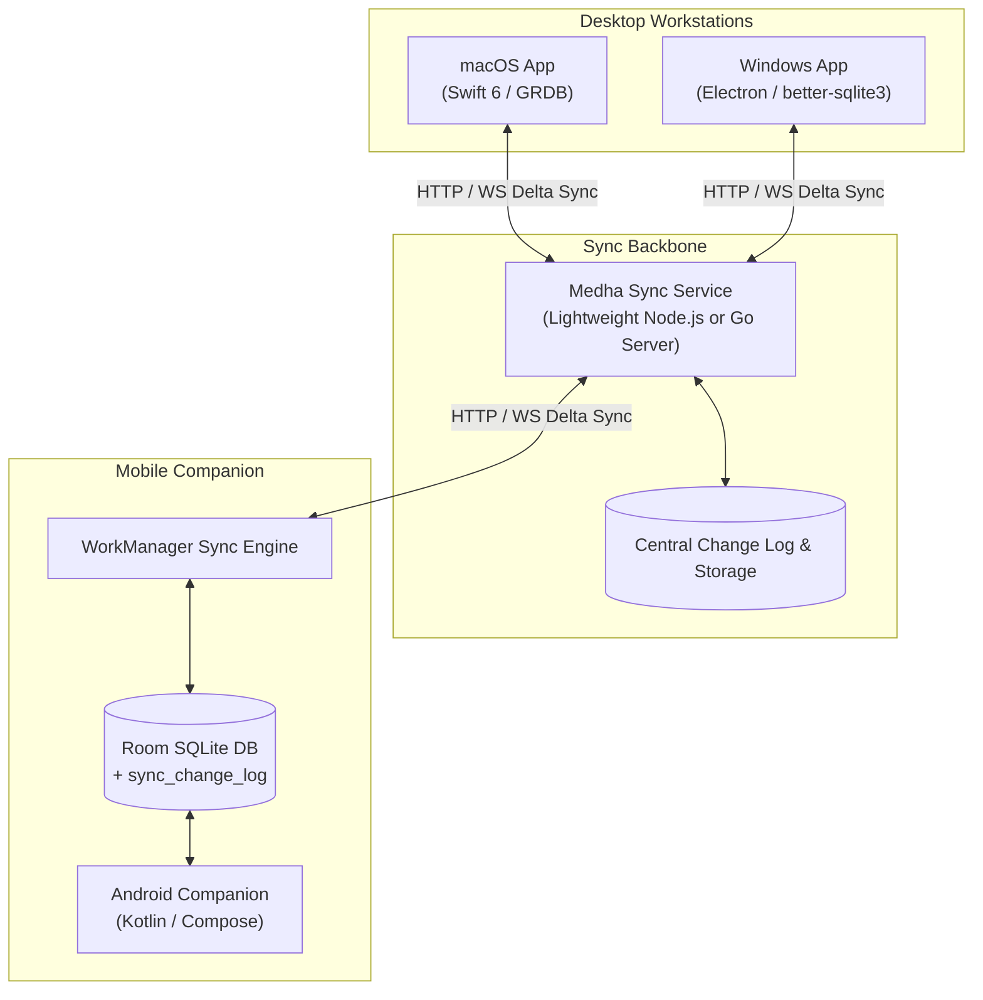

# Medha Android Accessory & Multi-Platform Sync Architecture

> **Parent Architecture**: Medha Cognitive Retention Engine & Spatial PKM  
> **Platforms**: macOS (Swift/GRDB) ⇄ Windows (Electron/SQLite) ⇄ Android (Kotlin/Room/Jetpack Compose)  
> **Sync Topology**: Local/Self-Hosted Sync Service (REST + WebSocket) with Delta High-Water Mark Cursors  

---

## 📱 Executive Overview & Accessory Philosophy

The **Medha Android App** is deliberately designed not as an identical desktop replacement with complex canvas editors or infinite drawing engines, but as a **high-speed mobile accessory companion** to the Mac and Windows desktop workstations.

### Core Companion Pillars
1. **Consumption & Reader Mode**: Instantaneous reading of notes, hierarchical block trees, and study materials with SQLite FTS5 search.
2. **Reviewing & Spaced Repetition**: Study flashcards anywhere on mobile with full mathematical parity to Mac's **FSRS-4.5** spaced repetition scheduler.
3. **Quick Capture**: Capture scratchpad thoughts, lecture bullets, or new flashcards with 1-tap floating actions that save instantly offline.
4. **Resilient Offline-First Synchronization**: Local SQLite persistence with an incremental mutation journal (`sync_change_log`) that synchronizes seamlessly with Mac and Windows via a lightweight self-hosted sync service.

---

## 🗺️ 10-Phase Roadmap Summary

```
Phase 0: Architecture, Android Gradle Toolchain & Scaffolding
   │
   ▼
Phase 1: SQLite / Room Schema Parity & FTS5 Search Engine
   │
   ▼
Phase 2: FSRS-4.5 Spaced Repetition Mathematical Engine
   │
   ▼
Phase 3: Mutation Journal (CDC) & Local Delta Tracker
   │
   ▼
Phase 4: Multi-Platform Sync Server & Delta Protocol Specification
   │
   ▼
Phase 5: Android Background Sync Client & Jetpack WorkManager
   │
   ▼
Phase 6: Jetpack Compose Document Reader & Search UI
   │
   ▼
Phase 7: Flashcard Study Session & FSRS Review UI
   │
   ▼
Phase 8: Quick Capture Scratchpad & Flashcard Creator UI
   │
   ▼
Phase 9: Multi-Device End-to-End Sync Audit & Release Hardening
```

| Phase | Title | Document | Deliverable |
|---|---|---|---|
| **Phase 0** | Toolchain & Scaffold | [PHASE_0_FOUNDATION.md](file:///Users/visheshmishra/Downloads/medharara/docs/android/PHASE_0_FOUNDATION.md) | Gradle Kotlin DSL, Jetpack Compose Material 3, Test runners |
| **Phase 1** | Schema & FTS5 | [PHASE_1_DATABASE_SCHEMA.md](file:///Users/visheshmishra/Downloads/medharara/docs/android/PHASE_1_DATABASE_SCHEMA.md) | Room / SQLite tables, triggers, indexes, FTS5 unicode61 |
| **Phase 2** | FSRS-4.5 Engine | [PHASE_2_FSRS_ENGINE.md](file:///Users/visheshmishra/Downloads/medharara/docs/android/PHASE_2_FSRS_ENGINE.md) | Pure Kotlin 17-parameter FSRS scheduler with Mac test parity |
| **Phase 3** | Mutation Journal | [PHASE_3_MUTATION_JOURNAL.md](file:///Users/visheshmishra/Downloads/medharara/docs/android/PHASE_3_MUTATION_JOURNAL.md) | `sync_change_log` CDC, triggers, Lamport timestamp generation |
| **Phase 4** | Sync Protocol & Server | [PHASE_4_SYNC_SERVER_AND_PROTOCOL.md](file:///Users/visheshmishra/Downloads/medharara/docs/android/PHASE_4_SYNC_SERVER_AND_PROTOCOL.md) | REST & WebSocket delta protocol, lightweight sync server |
| **Phase 5** | Sync Client Worker | [PHASE_5_CLIENT_SYNC_WORKER.md](file:///Users/visheshmishra/Downloads/medharara/docs/android/PHASE_5_CLIENT_SYNC_WORKER.md) | Android WorkManager worker, exponential backoff, conflict resolution |
| **Phase 6** | Reader & Search UI | [PHASE_6_DOCUMENT_READER_UI.md](file:///Users/visheshmishra/Downloads/medharara/docs/android/PHASE_6_DOCUMENT_READER_UI.md) | Compose hierarchical block reader, markdown, instant search |
| **Phase 7** | Study Session UI | [PHASE_7_FLASHCARD_STUDY_UI.md](file:///Users/visheshmishra/Downloads/medharara/docs/android/PHASE_7_FLASHCARD_STUDY_UI.md) | 3D card flip, 4 rating buttons with interval forecast, session summary |
| **Phase 8** | Quick Capture UI | [PHASE_8_QUICK_CAPTURE_UI.md](file:///Users/visheshmishra/Downloads/medharara/docs/android/PHASE_8_QUICK_CAPTURE_UI.md) | Global FAB, scratchpad note sheet, rapid flashcard creator |
| **Phase 9** | E2E Audit & Delivery | [PHASE_9_PRODUCTION_AUDIT.md](file:///Users/visheshmishra/Downloads/medharara/docs/android/PHASE_9_PRODUCTION_AUDIT.md) | 3-way sync integration test (Mac ⇄ Win ⇄ Android), APK packaging |

---

## 🏛️ Comprehensive Architecture & Synchronization Model



### 1. Database Schema Specifications (Mac / Windows Parity)

The Android companion uses the exact primary database structure defined in Mac's `DatabaseMigrations.swift`:

1. **`notebook`**: High-level knowledge domains (`id`, `name`, `icon`, `sortOrder`, `isArchived`, `updatedAt`).
2. **`document`**: Hierarchy nodes (`id`, `notebookId`, `title`, `icon`, `sortOrder`, `isPinned`, `createdAt`, `updatedAt`).
3. **`block`**: Atomic content nodes (`id`, `rootDocId`, `parentId`, `type`, `content`, `sortOrder`, `isCompleted`, `refTargetId`, `createdAt`, `updatedAt`).
4. **`block_fts`**: FTS5 virtual table tokenized with `unicode61` for millisecond full-text searching across all blocks.
5. **`flashcard`**: Spaced repetition items (`id`, `docId`, `notebookId`, `front`, `back`, `hint`, `fsrsState`, `stability`, `difficulty`, `elapsedDays`, `scheduledDays`, `reps`, `lapses`, `lastReview`, `due`, `createdAt`, `updatedAt`).
6. **`review_log`**: Historical reviews (`id`, `cardId`, `rating`, `scheduledDays`, `elapsedDays`, `reviewTime`, `state`, `lastState`).
7. **`deck_options`**: Per-deck tuning (`id`, `name`, `desiredRetention`, `maxIntervalDays`, `weightsJson`).
8. **`sync_change_log`**: Client mutation journal recording every local change for push syncing.
9. **`sync_state`**: Key-value table storing `last_server_cursor`, `device_id`, and `sync_endpoint`.

### 2. Multi-Platform Delta Synchronization Protocol

The synchronization protocol is designed for offline-first reliability:
- **No Direct Master-Slave Locks**: Devices can work offline indefinitely.
- **Change Data Capture (CDC)**: Every insert, update, or delete is appended to `sync_change_log` with an entity type, entity ID, JSON delta, timestamp, and device ID.
- **High-Water Mark Cursors**: Devices query `GET /api/v1/sync/pull?sinceCursor=N` to receive only mutations that occurred after cursor `N`.
- **Conflict Resolution Rules**:
  - **Flashcards & Review Logs**: Append-only log. Flashcard state resolves via highest `lastReview` timestamp. Review logs never conflict (UUID-keyed).
  - **Blocks & Notes**: Field-level or Last-Write-Wins (LWW) based on `updatedAt` with device ID tie-breaker.
  - **Documents & Notebooks**: Soft deletions (`isArchived = 1`) to preserve child blocks during concurrent edits.

---

## 🛠️ Verification & Quality Assurance Strategy

1. **Exact Mathematical Parity**: Automated unit tests assert that given any `(stability, difficulty, elapsedDays, rating)`, the Kotlin FSRS engine produces interval and stability outputs identical to `FSRSScheduler.swift`.
2. **Schema Integrity**: Automated tests verify all SQLite tables, foreign key constraints (`ON DELETE CASCADE`), and FTS5 triggers.
3. **Sync Simulation**: Automated tests simulate multi-device concurrent edits (e.g., student reviews 50 cards on Android while editing notes on Mac) and verify convergence without data corruption or duplicates.
