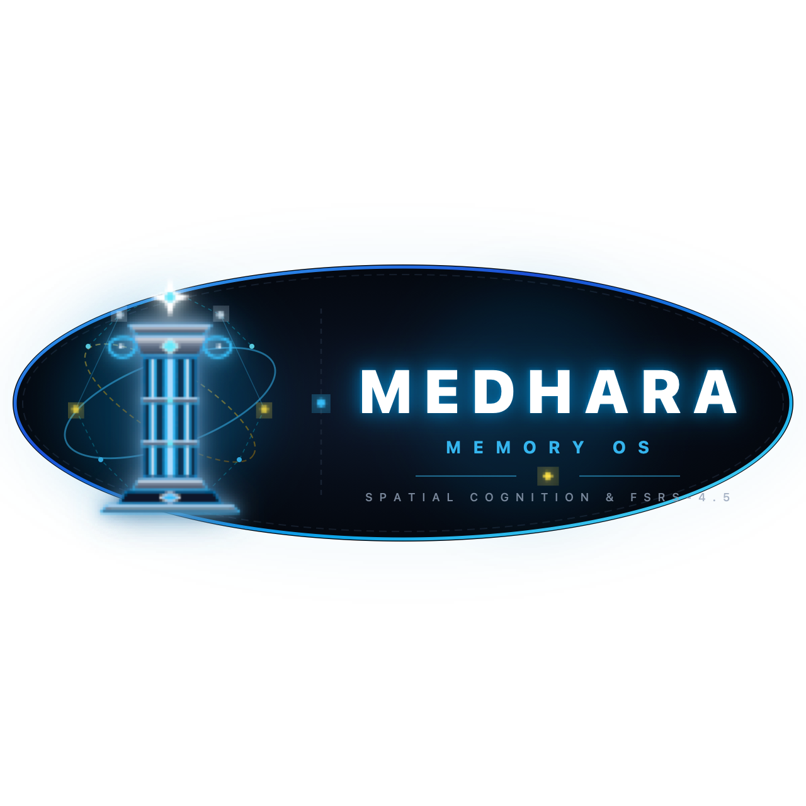

<div align="center">
  
  <br /><br />

  [](https://www.apple.com/macos/)
  [-success?logo=apple&style=for-the-badge)](https://github.com/VisheshMis/medhara_ios/releases/latest/download/Medha-macOS.dmg)
  [](https://swift.org)
  [](https://github.com/open-spaced-repetition/fsrs4anki)
  [](#9--dual-mode-ai-with-per-provider-key-isolation)
  [](#3--anki-ecosystem--deck-customization)
  [](#-testing--quality-assurance)
  [](LICENSE)

  <p align="center">
    <strong>An offline-first, native macOS Cognitive Retention Engine & Spatial PKM.</strong><br />
    Unifying 2-step hierarchical auto-notes, handwritten vector notes, GPU knowledge graphs, the ancient Method of Loci, and modern FSRS-4.5 spaced repetition with multi-source academic grounding.
  </p>
  <p align="center">
    <a href="https://github.com/VisheshMis/medhara_ios/releases/latest/download/Medha-macOS.dmg"><strong>⬇️ Download Medha for macOS (.dmg)</strong></a> &bull;
    <a href="https://github.com/VisheshMis/medhara_ios/releases/latest/download/Medha-macOS.zip">Download (.zip)</a> &bull;
    <a href="https://github.com/VisheshMis/medhara_ios/releases/latest">Release Notes</a>
  </p>
</div>

> **मेधा (Medha)** — *Sanskrit for intellect, capacity for profound comprehension, and the power of indelible memory.*

---

## 📑 Table of Contents
- [🌟 The Cognitive Memory Architecture](#-the-cognitive-memory-architecture)
- [✨ Core Feature Suite](#-core-feature-suite)
  - [1. 🪄 2-Step Auto-Note Formation Pipeline (P1–P11)](#1--2-step-auto-note-formation-pipeline-p1p11)
  - [2. 📚 Deep Master Plan Curriculum Generator](#2--deep-master-plan-curriculum-generator)
  - [3. 📦 Anki Ecosystem & Deck Customization](#3--anki-ecosystem--deck-customization)
  - [4. 🗂️ Refined Hierarchical Block Notes & PKM](#4-️-refined-hierarchical-block-notes--pkm)
  - [5. ✍️ Infinite & Multi-Page Vector Ink Notes](#5-️-infinite--multi-page-vector-ink-notes)
  - [6. 🧠 3D Spaced Repetition (FSRS-4.5)](#6--3d-spaced-repetition-fsrs-45)
  - [7. 🏛️ 2D Spatial Memory Palace & Walk Mode (Method of Loci)](#7-️-2d-spatial-memory-palace--walk-mode-method-of-loci)
  - [8. 🕸️ GPU-Accelerated Knowledge Graph (Global & Local)](#8-️-gpu-accelerated-knowledge-graph-global--local)
  - [9. 🤖 Dual-Mode AI with Per-Provider Key Isolation](#9--dual-mode-ai-with-per-provider-key-isolation)
  - [10. 🌐 8+ Multi-Subject Academic Open APIs (0 API Keys)](#10--8-multi-subject-academic-open-apis-0-api-keys)
  - [11. ⏱️ Focus Engine & Native macOS Lifecycle](#11-️-focus-engine--native-macos-lifecycle)
  - [12. 🌐 Standalone Web Companion Client](#12--standalone-web-companion-client)
- [⌨️ Keyboard Shortcuts](#️-keyboard-shortcuts)
- [🏗️ Technical Architecture & Stack](#️-technical-architecture--stack)
- [📂 Project Structure](#-project-structure)
- [🧪 Testing & Quality Assurance](#-testing--quality-assurance)
- [🚀 Building & Running](#-building--running)
- [📖 Documentation Links](#-documentation-links)
- [📄 License](#-license)

---

## 🌟 The Cognitive Memory Architecture

Traditional knowledge tools act as passive digital filing cabinets—notes are written, filed, and forgotten. Medha closes the cognitive loop through an active, bidirectional pipeline:

```
[ Active Intake & Auto-Notes ]     [ Associative Synthesis ]          [ Long-Term Consolidation ]
+----------------------------+     +-----------------------+          +-------------------------+
| 2-Step Hierarchical Notes  | --> | GPU Knowledge Graph   | -------> | 2D Spatial Memory Palace|
| (Skeleton -> On-Demand Fill) | <-- | (Bi-directional links)| <------- | (Method of Loci Walk)   |
+----------------------------+     +-----------------------+          +-------------------------+
              |                                                                    |
              +-------------------------> [ FSRS-4.5 ] <---------------------------+
                                          [ Flashcards ]
                                        (3D Flip & Recall)
```

1. **Intake & Structured Capture**: Rapidly plan hierarchical knowledge skeletons with content-representative headings and immediately commit them to disk.
2. **On-Demand Deep Synthesis**: Synthesize dense, evidence-backed notes block-by-block with live API routing, conflict resolution, and automated QA gates.
3. **Associative Comprehension**: Traverse concepts visually in a 60–120 FPS force-directed knowledge graph with blended hierarchy and wiki-links.
4. **Spatial Encoding**: Anchor knowledge nodes and flashcards to architectural landmarks across multi-photo spatial canvases using the ancient Method of Loci.
5. **Indelible Active Recall**: Review using the state-of-the-art FSRS-4.5 scheduler featuring 3D perspective flip cards, live interval previews, and Anki collection compatibility.

---

## ✨ Core Feature Suite

### 1. 🪄 2-Step Auto-Note Formation Pipeline (P1–P11)

Medha features an autonomous 11-phase note formation pipeline designed to prevent model output limits and avoid batch failure:

```
Step 1: Rapid Skeleton Planning & Instant Persistence
[ P1 Grounding ] -> [ P2 Skeleton Planner ] -> [ P3 Structural Reviewer ]
        |
        v
  [ Immediate SQLite Disk Commit: All Skeletal Documents Saved ]

Step 2: In-Node On-Demand Verified Content Fill
[ Skeletal Note Opened ] -> [ Click "Generate Full Content & Citations" ]
        |
        v
[ P4 Router ] -> [ P5 Query Builder ] -> [ P6 Evidence Validator ] -> [ P7 Note Writer ] -> [ P9 QA Gate ]
        |
        v
  [ Replaces Skeletal Placeholder with Rich Formatted Sections & Citations ]
```

- **Step 1: Rapid Skeleton Planning & Instant Persistence**:
  - **P1 Grounding**: Queries encyclopedic sources to resolve conceptual ambiguity and choose the exact root sense.
  - **P2 Skeleton Planner**: Proposes a balanced, multi-tier downward hierarchy with **content-representative headings** (enforcing strict negative constraints against generic placeholders like "Overview", "Mechanics", or "Applications").
  - **P3 Structural Reviewer**: Scans the proposed tree for leaf-word imbalance, semantic overlap, and missing prerequisite links.
  - **Immediate Disk Commitment**: The entire skeletal tree is instantly committed to SQLite disk with downward parent-child relationships and skeletal scope markers (`🪄 Skeletal Note • Scope: ...`). Notes are never lost or wiped out.
- **Step 2: In-Node On-Demand Verified Content Fill**:
  - When opening any skeletal note in `BlockEditorView`, an interactive banner card appears: **"Skeletal Note • Ready to Fill Content"** with depth selection (`Overview`, `Working`, `Expert`).
  - Clicking **"Generate Full Content & Citations (AI)"** executes the isolated single-document synthesis pipeline:
    - **P4 Router**: Allocates API budgets across academic databases.
    - **P5 Query Builder**: Constructs precise endpoint queries.
    - **P6 Evidence Validator**: Cross-checks facts, scores relevance, and flags conflicting claims.
    - **P7 Note Writer**: Synthesizes verified sections with citations (`## Executive Summary`, `## Core explanation: Detailed Mechanisms`, `## Comparative Dimensions`, `## Direct Evidence & Citations`, `## Verification & Critical Limits`).
    - **P9 QA Gate**: Automated reviewer auditing hallucination, section completeness, and evidence density.
  - Replaces the skeletal placeholder with rich, formatted blocks in real time while preserving all existing child sub-notes.

---

### 2. 📚 Deep Master Plan Curriculum Generator

For broad disciplines requiring expansive, structured mastery:
- **Encyclopedic Syllabus Synthesis**: Fetches authentic Wikipedia section outlines to propose a comprehensive curriculum index.
- **Interactive Chapter Review**: Reorder, rename, delete, or add custom chapters before synthesis begins.
- **Incremental Background Generation**: Synthesizes chapters sequentially with live progress indicators and automatic stop-and-keep persistence.
- **Master Syllabus Index**: Injects an executive syllabus callout and chapter table-of-contents with bi-directional wiki-links.

---

### 3. 📦 Anki Ecosystem & Deck Customization

Full interoperability with the broader spaced repetition ecosystem:
- **Native Anki Importer**:
  - Supports both legacy SQLite (`.anki2`) and modern zstd-compressed (`.anki21`) decks.
  - Bundled with a native C-based decompression utility (`unzstd`) for zero-dependency deck extraction.
  - Imports cards, notes, decks, tags, and cloze deletions seamlessly into Medha's database.
- **Anki-Style Deck Options Presets**:
  - Configurable daily limits: **New Cards / Day** and **Maximum Reviews / Day**.
  - Custom learning steps, lapse steps, minimum intervals, and leech thresholds.
  - Audio autoplay toggles and preset assignment per notebook or subject deck.
- **Comprehensive Card Browser**:
  - Multi-column table inspection: Front, Back, Deck, State, Due Date, Stability ($S$), and Difficulty ($D$).
  - Search and filter by deck, tag, or card state (`New`, `Learning`, `Review`, `Relearn`).
  - Inline editing sheet allowing immediate card adjustments.
- **Daily Retention & Streak Analytics**:
  - Tracks review count, retention rates, and study streaks over time.

---

### 4. 🗂️ Refined Hierarchical Block Notes & PKM

- **Living Folder Command-Hub Header**: Every document opens with an informative metadata scrim showing parent notebook path, child sub-page count, word count, estimated reading time, and attached active flashcards.
- **Centered 740pt Typographic Measure**: Notes are rendered within an optimal reading column (`maxWidth: 740pt`) with generous whitespace, eliminating horizontal eye strain on ultra-wide macOS displays.
- **Granular Block Engine**: Full block hierarchy supporting Headings 1–3, Paragraphs, Bullet Lists, Interactive To-Dos, Code Blocks, Quotes, Callouts, and Transclusions.
- **Caret & Keystroke Continuity**:
  - Boundary traversal: Pressing `↑` at the top of a block transitions the cursor smoothly to the previous block; pressing `↓` at the end jumps forward.
  - Smart backspace handling: Pressing backspace at column 0 in a list downgrades the bullet to a regular paragraph before merging with the preceding block.
- **Zero-Lag Typing Isolation**: Keystroke edits update in-memory published properties instantly without triggering round-trip database reloads or cursor jumps.
- **Bi-Directional Linking (`[[WikiLink]]`)**: Spontaneous conceptual webs. SQLite `doc_link` index maintains relationships without disrupting notebook trees.
- **Block Transclusion (`((b-uuid))`):** Embed any block from any document into your notes with real-time bidirectional synchronization.
- **Full-Text Search (FTS5)**: Millisecond queries across thousands of notes and blocks using SQLite FTS5 with BM25 relevance ranking.
- **One-Click Export**: Export notes to clean GitHub-Flavored Markdown or structured JSON (`⌘E`).

---

### 5. ✍️ Infinite & Multi-Page Vector Ink Notes

Medha includes a high-performance vector handwriting canvas designed for Apple Pencil, stylus, and trackpad drawing:
- **Continuous Multi-Page Canvas**: Organize complex mathematical derivations, anatomical sketches, and visual mindmaps across sequential, independently indexed vector pages.
- **Paper Template Presets**: Switch instantly between Blank, Lined (28pt rule), Grid (20pt graph paper), and Dot Matrix (20pt grid) background scrims.
- **Natural Stroke Smoothing**: High-fidelity Catmull-Rom cubic spline interpolation transforms raw digitizer coordinates into fluid, organic curves without geometric jitter.
- **Velocity & Dynamic Pressure Modeling**: Stroke thickness and opacity dynamically respond to stylus velocity and contact pressure curves for expressive penmanship.
- **Lasso Selection & Spatial Manipulation**: Freehand lasso tool powered by ray-casting point-in-polygon math lets you circle, select, translate, and re-position strokes across the canvas.
- **Lossless Storage & SVG Vector Export**: Strokes are serialized as compact point arrays in SQLite, enabling infinite zoom fidelity and sharp vector export without pixelation.

---

### 6. 🧠 3D Spaced Repetition (FSRS-4.5)

- **FSRS-4.5 Scheduler**: Implements the Free Spaced Repetition Scheduler modeling memory Stability ($S$), Difficulty ($D$), and Retrievability ($R$), vastly outperforming legacy SM-2 algorithms.
- **3D Perspective Card Flip**: Spring-animated 3D flip card (`rotation3DEffect`, perspective 0.6) for tactile review sessions.
- **Real-Time Interval Preview Chips**: Review buttons (`Again`, `Hard`, `Good`, `Easy`) display their dynamic next scheduled dates (e.g. `10m`, `1.2d`, `4.8d`, `12.5d`) calculated by FSRS in real time.
- **Single-Key Review Ergonomics**:
  - `Space`: Flip card to reveal answer or advance.
  - `1`, `2`, `3`, `4`: Instantly select review ratings.
- **Gradient Progress HUD**: Colorful top progress bar tracking completed cards vs. remaining due cards.
- **AI Socratic Tutor with Auto-Focus**: In Socratic mode, Medha automatically focuses the student's answer textfield (`@FocusState`), evaluates answers against card context, and suggests rating grades.

---

### 7. 🏛️ 2D Spatial Memory Palace & Walk Mode (Method of Loci)

- **Multi-Photo Infinite 2D Canvas**: Import multiple high-resolution photos of real-world spaces (homes, campuses, art galleries, architecture) into a vast, zoomable, pannable 2D canvas.
- **Sequential Loci Pathways**: Place numbered locus pins onto architectural landmarks and link them into sequential memory journeys with visual pathway lines.
- **Cinematic Spring Camera Navigation**: Walk Mode glides smoothly between loci using `.interactiveSpring(response: 0.45, dampingFraction: 0.86)` physics, auto-centering and framing each pin without jarring cuts.
- **Frosted Glass Pin Callouts**: Loci pins feature `.ultraThinMaterial` frosted glass scrims with pulsing radar beacons indicating the active step in your journey.
- **Floating Walk HUD Pill**: Sleek bottom control pill with arrow navigation shortcuts (`←`, `→`, `Space`, `Esc`) and a direct **"Jump to Source Note"** button.
- **Integrated Active Recall & Flashcard Testing**: Practice retrieving anchored concepts directly at each locus, rate your recall (`Remembered`, `Needed Clue`, `Forgot`), and complete review sessions with celebratory confetti.

---

### 8. 🕸️ GPU-Accelerated Knowledge Graph (Global & Local)

- **Metal / SwiftUI Immediate-Mode Canvas**: Renders 1,000+ nodes and edges at **60–120 FPS** with zero DOM overhead.
- **1-Click Layer Presets**:
  - `[Links Only] (Default)`: Visualizes associative wiki-links and block references (`LINKS_TO`).
  - `[Tree Only]`: Visualizes folder and notebook parent-child hierarchy (`CONTAINS`).
  - `[Blended]`: Renders both layers simultaneously. `CONTAINS` edges display as dashed, dimmer purple lines (`[4, 4]`), while `LINKS_TO` edges display as solid green lines.
- **Cooling Alpha Physics (0% CPU at Rest)**: 2D force simulation with Coulomb repulsion, Hooke spring attraction, and velocity damping. Alpha automatically decays to rest (`alpha < 0.002`), consuming **0% CPU and 0% battery** when idle.
- **Visual Clustering & Controls**:
  - Tag-based and folder-based color clustering.
  - Interactive controls sheet for link length, charge repulsion, center force, label display modes, and search filtering.
- **Dynamic Level of Detail (LOD)**: Text labels smoothly hide below `0.65x` zoom for panoramic views and reappear when zooming or hovering.
- **Degree-Scaled Vertex Sizing**: Node radius scales gracefully with degree (`inDegree + outDegree`).
- **Ghost Links for Future Notes**: Unwritten `[[Future Notes]]` appear as dashed outline nodes. Clicking them creates the note immediately.
- **Inspector Local Graph Panel**: Scoped to the currently open note with **1-Hop**, **2-Hop**, and **3-Hop** BFS depth control and directional arrowheads (`→` Outbound green, `←` Inbound cyan).

---

### 9. 🤖 Dual-Mode AI with Per-Provider Key Isolation

- **Per-Provider Key Isolation**: Independent API key storage and state management for Groq, Google Gemini, and OpenAI, preventing cross-model key overwriting.
- **100% Offline Local AI (<4 GB RAM)**:
  - Run compact open-weight models locally on macOS via [Ollama](https://ollama.com), LM Studio, or llama.cpp.
  - **Recommended Default**: **`qwen2.5:1.5b`** (~980 MB, runs in <2 GB RAM with Metal GPU acceleration).
  - Also supports `deepseek-r1:1.5b`, `llama3.2:1b`, `llama3.2:3b`, `smollm2:1.7b`, and `mistral:7b`.
  - Zero cloud API keys required, zero subscription fees, and complete offline privacy.
- **Reasoning Model Support (DeepSeek-R1 / QwQ)**:
  - Distilled reasoning models output chain-of-thought `<think>...</think>` tokens.
  - Medha features automatic regex sanitization that parses reasoning thoughts away, extracting pristine structured JSON outlines and Socratic dialogues.
- **Independent Dual Configuration**: Run Local AI for flashcard Socratic tutoring while using Groq or Gemini for deep note synthesis.

---

### 10. 🌐 8+ Multi-Subject Academic Open APIs (0 API Keys)

Medha pairs inference with real-time academic evidence retrieval across 8+ public repositories with zero subscriptions or API keys:

| Domain | Source | Coverage & Data Retrieved |
| :--- | :--- | :--- |
| 🌐 **General & Encyclopedic** | **Wikipedia** | Encyclopedic summaries, section outlines, and foundational definitions |
| 🎓 **STEM, CS & Humanities** | **OpenAlex & CrossRef** | 250M+ academic papers with inverted-index abstract reconstruction |
| 🧬 **Biomedical & Clinical** | **PubMed (NCBI)** | Peer-reviewed medical literature, clinical trials, and life science research |
| 🔬 **Life Sciences & Genetics** | **Europe PMC** | Open biomedical articles, pharmacology papers, and PMC full-text excerpts |
| 📐 **Physics, Math & Computing**| **arXiv** | High-energy physics, computational linguistics, AI preprints, and mathematics |
| 📜 **History & Literature** | **Open Library** | Historical texts, classic literature, and archive book summaries |
| 📖 **Lexicon & Etymology** | **Wiktionary** | Terminology definitions, grammatical parts of speech, and linguistic origin |
| 🗣️ **Phonetics & Pronunciation** | **Free Dictionary** | Standardized definitions, phonetics, and grammatical audio hints |

- **Automatic Subject Domain Detection**: Analyzes note context to detect subject domains (`Biomedical`, `STEM`, `Literature`, `History`, `Lexicon`) and routes queries to relevant repositories.
- **Parallel Query Execution**: All enabled sources are fetched concurrently via Swift `withTaskGroup`.
- **Parameter-Aware Budgeting**: For 1.5B–3B models, Medha automatically budgets extracts to ~400–500 concise characters per source, keeping prompts dense and preventing small models from losing attention.

---

### 11. ⏱️ Focus Engine & Native macOS Lifecycle

- **Pomodoro Focus Timer**: Persistent timer ring at the top of the sidebar supporting Focus (25m), Short Break (5m), and Long Break (15m).
- **Active Screen Window Positioning**: Intelligently positions and centers windows on the display where the user's cursor is active.
- **Multi-Window Support (`⌘⌥N`)**: Open secondary note windows without split-view collisions or restoration corruption.

---

### 12. 🌐 Standalone Web Companion Client

Located in [`/web`](web/):
- Full-featured browser-based PKM implementation with matched styling and behavior.
- Local browser persistence (IndexedDB / LocalStorage), visual knowledge graph canvas, FSRS-4.5 review state machine, and multi-source study grounding.

---

## ⌨️ Keyboard Shortcuts

| Shortcut | Action | Scope |
| :--- | :--- | :--- |
| `⌘ N` | Create New Note | Global |
| `⇧ ⌘ N` | Create New Notebook | Global |
| `⌘ ⌥ N` | Open New Window | Global |
| `⌘ K` | Open Command Palette / Global Search | Global |
| `⌘ I` | Toggle Right Inspector Panel | Global |
| `⌘ G` | Open Knowledge Graph Canvas | Global |
| `⌘ E` | Export Current Note (Markdown / JSON) | Notes Editor |
| `/` | Trigger Slash Block Command Menu | Notes Editor |
| `((` | Insert Block Transclusion Embed | Notes Editor |
| `[[` | Insert Bi-Directional WikiLink | Notes Editor |
| `↑ / ↓` | Jump Cursor to Previous / Next Block | Notes Editor |
| `Space` | Flip Card / Next Locus | Flashcards & Palace |
| `1, 2, 3, 4` | Rate Card (`Again`, `Hard`, `Good`, `Easy`) | Flashcards |
| `← / →` | Step Backward / Forward in Loci Route | Memory Palace |
| `Double Click Node` | Pin / Unpin Vertex in Graph | Graph Canvas |
| `Double Click Canvas`| Reset Zoom & Re-center Camera | Graph Canvas |

---

## 🏗️ Technical Architecture & Stack

```
+-----------------------------------------------------------------------------------------+
|                                    Medha Application                                    |
|  +--------------------+  +----------------------+  +---------------------------------+  |
|  |    Notes Editor    |  |   Knowledge Graph    |  |     Memory Palace & Canvas      |  |
|  |  (Block PKM / FTS) |  | (Force Sim Canvas)   |  |     (2D Spatial Loci Walk)      |  |
|  +--------------------+  +----------------------+  +---------------------------------+  |
|  +-----------------------------------------------------------------------------------+  |
|  |                       MedhaKit Domain Services & Protocols                        |  |
|  |  - BlockStore (State & Queries)          - ForceSimulation (Cooling Alpha 0% CPU) |  |
|  |  - FSRSScheduler (v4.5 Memory Model)     - AISocraticService (Dual Engine Router) |  |
|  |  - AutoNotePipelineService (P1-P11)      - MasterPlanService (Curriculum Engine)  |  |
|  |  - AnkiImporter (unzstd native parser)   - DailyStudyTracker (Retention Metrics)  |  |
|  |  - StudyKnowledgeService (8+ Academic Open APIs: PubMed, arXiv, OpenAlex, etc.)   |  |
|  +-----------------------------------------------------------------------------------+  |
|  +-----------------------------------------------------------------------------------+  |
|  |                             Persistence & Storage Layer                           |  |
|  |  - GRDB.swift with SQLite 3.45+           - WAL Mode (High Concurrency)            |  |
|  |  - FTS5 Full-Text Search Engine           - Indexed doc_link Graph Relationships  |  |
|  +-----------------------------------------------------------------------------------+  |
+-----------------------------------------------------------------------------------------+
```

- **Languages & Frameworks**: Swift 5.9+, SwiftUI, AppKit native macOS integration
- **Database**: SQLite 3.45+ via [GRDB.swift](https://github.com/groue/GRDB.swift) (WAL mode, foreign key cascade integrity, automatic migrations)
- **Search Engine**: SQLite FTS5 virtual tables with Porter stemming and BM25 ranking
- **Rendering**: GPU immediate-mode `Canvas` on Metal backend for graph; vast spatial matrix transforms for 2D Memory Palace
- **Decompression**: Bundled native `unzstd` binary for `.anki21` archives

---

## 📂 Project Structure

```
medharara/
├── Package.swift                             # Swift Package Manager manifest
├── README.md                                 # Main repository documentation & showcase
├── LOCAL_AI_SETUP.md                         # Detailed Local AI & Ollama setup guide
├── Medhara_Complete_Presentation_Flow.pdf    # Full technical & product presentation deck
├── Medha.app/                                # Compiled macOS universal release application
│   └── Contents/MacOS/Medha                  # Native binary executable
├── Resources/                                # Helper tools & decompression binaries (unzstd)
├── web/                                      # Standalone web companion client
├── Sources/
│   ├── MedhaApp/
│   │   └── MedhaApp.swift                    # Application entrypoint, menu commands, shortcuts
│   ├── MedhaKit/
│   │   ├── Database/                         # GRDB DatabaseManager, schema migrations, seeders
│   │   ├── Models/                           # Block, DocLink, Flashcard, DeckOptions, InkStroke, AutoNoteSchemas
│   │   ├── Services/                         # BlockStore, ForceSimulation, AISocratic, FSRS, InkGeometry,
│   │   │                                     # AutoNotePipelineService, MasterPlanService, AnkiImporter
│   │   └── UI/
│   │       ├── Editor/                       # BlockEditor, InkNoteEditor, InkCanvas, SlashMenu, NotesAIAssistant
│   │       ├── Flashcards/                   # FlashcardManager, CardBrowser, DeckOptionsSheet
│   │       ├── Graph/                        # GlobalGraphView, GraphCanvasView, GraphControlsSheet
│   │       ├── Inspector/                    # InspectorView, Outline, Backlinks, LocalGraphView
│   │       ├── MemoryPalace/                 # MemoryPalaceView, Multi-photo 2D canvas, Walk mode
│   │       └── Navigation/                   # SidebarView, DocumentTreeView, MainSplitView
│   └── MedhaTestRunner/
│       └── main.swift                        # Automated integration test runner (37 suites)
```

---

## 🧪 Testing & Quality Assurance

Medha incorporates an extensive, non-mocked integration test runner that verifies core storage invariants, mathematical scheduling correctness, spatial rendering bounds, and API recovery against live and in-memory SQLite instances:

```bash
# Execute the complete automated test suite
swift run MedhaTestRunner
```

### Core Verification Domains

| Domain | Invariants & Subsystems Verified |
| :--- | :--- |
| **🗄️ Relational Store & FTS5** | SQLite schema migrations, WAL mode concurrency, foreign key cascade trees, bi-directional transclusion backlinks, and millisecond BM25 full-text indexing. |
| **🧠 Cognitive & FSRS-4.5 Engine** | Exact interval, stability ($S$), difficulty ($D$), and retrievability ($R$) state transitions across all review outcomes; deck options presets, daily limits, and leech handling. |
| **🏛️ Spatial Memory & Physics** | Multi-photo coordinate bounds, sequential loci pathways, `.interactiveSpring` camera tracking, and Coulomb/Hooke graph physics cooling to 0% idle CPU. |
| **✍️ Vector Ink & Continuous Canvas** | Catmull-Rom cubic spline interpolation, velocity-weighted stroke widths, ray-casting point-in-polygon lasso detection, and dynamic page reindexing. |
| **🤖 Autonomous AI Pipeline** | P1–P11 prompt sequencing, API catalog routing, tree mutation safety, skeletal placeholder insertion, and DeepSeek-R1 / QwQ `<think>` sanitization. |
| **📦 Anki Ecosystem Interoperability** | Direct `.anki2` and zstd-decompressed (`.anki21`) SQLite database parsing, cloze deletion extraction, and note-to-card schema mapping. |

<details>
<summary><strong>🔍 View Complete Test Suite Manifest (37 Automated Suites)</strong></summary>

<br />

1. `testDatabaseInitializationAndSeeding` — SQLite schema setup, WAL mode, foreign key integrity.
2. `testBlockCRUDOperations` — Block creation, indentation, hierarchy assignment, and sort orders.
3. `testTaskBlockToggle` — Interactive to-do checkmarks and persistence.
4. `testFTS5Search` — Millisecond BM25 full-text queries across document blocks.
5. `testBlockReferencesAndBacklinks` — Bi-directional transclusion index and backlinks discovery.
6. `testOutlineGeneration` — Dynamic heading hierarchy extraction (H1–H3).
7. `testDocumentHierarchyAndTree` — Parent-child folder nesting and breadcrumb traversal.
8. `testDocumentAncestryBreadcrumbs` — Root-to-leaf path resolution.
9. `testTreeExpansionAndFilter` — Folder expansion states and text filtering.
10. `testRecursiveCascadeDeletion` — Safe recursive deletion of sub-trees without orphaned rows.
11. `testDiskDatabaseAndSeededHierarchy` — Multi-session disk persistence and SQLite stability.
12. `testFocusTimerStateCycle` — Pomodoro cycle transitions and countdown tick accuracy.
13. `testFSRSScheduler` — FSRS-4.5 interval calculation, stability, and difficulty curves.
14. `testFlashcardsInHierarchyAndStore` — Card generation scoped to note hierarchies.
15. `testMemoryPalaceAnd2DLoci` — Spatial loci placement, coordinate math, and persistence.
16. `testLinksAreNotHierarchyConstraint` — Structural separation of `LINKS_TO` directed graph vs `CONTAINS` tree.
17. `testMultiPhotoPalaceAndLocusAnchors` — Multi-photo 2D canvas positioning and locus route sequencing.
18. `testVastSpatialCanvasAndAssetStorage` — Safe local asset copying and high-resolution photo bounds.
19. `testFlashcardDecksAndNoteGrouping` — Custom decks and note-grouped default decks.
20. `testMockNotesDecksAndMemoryPalaces` — Default study retention seeder validation.
21. `testAISocraticEvaluationAndSettings` — Multi-provider AI configuration and key verification.
22. `testNotesAIDownwardHierarchyAndDualConfiguration` — Downward note outline synthesis and dual configs.
23. `testLocalAIAndWikipediaGrounding` — Ollama endpoint validation, Wikipedia grounding prompt injection.
24. `testBulletListFormattingAndMultilineCollision` — Text line spacing and multiline collision prevention.
25. `testNoteTitleFocusStability` — Keystroke isolation and stable title focus without cursor shifts.
26. `testCalloutExclusionInAIGeneration` — Clean outline generation without redundant callout boxes.
27. `testGraphViewAndPhysicsEngine` — Indexed graph reads, layer separation, ghost nodes, orphan filtering, BFS local graph hops, and cooling alpha physics rest.
28. `testHybridStudyGroundingAndReasoningSanitization` — OpenAlex inverted index abstract decoding, Europe PMC biomedical search, Wiktionary lexical definitions, multi-source parallel fetch, parameter-aware budget limits, and DeepSeek-R1 / QwQ `<think>` tag sanitization.
29. `testDeckOptionsPresetsAndCardManagement` — Anki-style options presets, daily review limits, and card browser operations.
30. `testAnkiImporterSuite` — `.anki2` and `.anki21` zstd-decompressed database parsing and card extraction.
31. `testMultiSubjectDomainsAndOpenAPIs` — PubMed biomedical, arXiv physics/math/CS, Open Library, and Free Dictionary integrations.
32. `testDeepMasterPlanSynthesis` — Multi-chapter syllabus generation, Wikipedia outline extraction, and quote protection.
33. `testMalformedJSONRecoveryAndIncrementalPersistence` — Resilience against JSON leaks and partial chapter persistence.
34. `testAutoNoteFormationPipeline` — P1–P11 prompts, 20 API catalog normalization, tree edit safety handlers, and in-node skeletal markers.
35. `testInkNotesModelAndHierarchyIntegration` — Document hierarchy integration, template types (blank, lined, grid, dot), and page model persistence.
36. `testVectorInkGeometryAndPersistence` — Stroke serialization, Catmull-Rom smoothing, velocity-weighted stroke width, and point compression.
37. `testMultiPageContinuousCanvasLassoAndExport` — Multi-page continuous canvas, lasso polygon selection, stroke translation, and SVG vector export.

</details>

---

## 🚀 Building & Running

### Prerequisites
- macOS 14.0 (Sonoma) or macOS 15.0+ (Sequoia)
- Xcode 15.0+ or Apple Command Line Tools (`xcode-select --install`)
- Swift 5.9+

### Build from Source
```bash
# Clone the repository
git clone https://github.com/VisheshMis/medhara_ios.git
cd medhara_ios

# Build optimized release binary
swift build -c release

# Run Medha
swift run -c release Medha
```

### Pre-Compiled macOS Application
You can directly launch the compiled release application bundle:
```bash
open Medha.app
```

---

## 📖 Documentation Links

- [Local AI & Multi-Source Grounding Setup Guide](LOCAL_AI_SETUP.md)
- [Complete Product & Technical Presentation Deck (PDF)](Medhara_Complete_Presentation_Flow.pdf)
- [FSRS Spaced Repetition Scheduling Algorithm](https://github.com/open-spaced-repetition/fsrs4anki)
- [GRDB.swift SQLite Documentation](https://github.com/groue/GRDB.swift)

---

## 📄 License

Distributed under the **MIT License**. See `LICENSE` for more information.
