# Architectural Analysis & 5-Tier Feasibility Plan: Notion Features for Medha Mac

This document provides an exhaustive architectural evaluation and 5-tier feasibility breakdown of the **Notion Workspace Platform** specification for **Medha Mac** (a native macOS Swift 5.9+, AppKit/SwiftUI, offline-first GRDB SQLite, Apple Silicon optimized application).

---

## 🧭 Executive Summary & Medha Mac Context

Medha Mac is built around high-performance native macOS engineering:
- **Core Stack**: Swift 5.9+, macOS 14.0+, SwiftUI + AppKit (`NSTextView`, `NSView`), GRDB (SQLite), Metal/GPU acceleration, FSRS-4.5 spaced repetition, and Apple Pencil/vector ink.
- **Key Constraints & Pillars**: 
  1. **Offline-First & Zero Latency**: No blocking network round-trips for document editing.
  2. **Memory & Battery Efficiency**: Avoiding Electron/WebKit memory bloat (maintaining lean RAM footprint).
  3. **Stability & Sandboxing**: Preventing AppKit main-thread lockups, recursion stack overflows, and sandboxed crash loops.

To evaluate Notion's feature set for Medha Mac, every feature is assessed across 5 distinct tiers based on native Swift feasibility, dependency weight, performance implications, and crash hazards.

---

## 🚦 The 5-Tier Evaluation Matrix

```
[Tier 1: Native Swift / Zero-Risk]     -> Instant GRDB SQLite / AppKit wins. 0% crash risk.
[Tier 2: Moderate Architecture]         -> Standard macOS UI & relational schema additions. Low risk.
[Tier 3: High Effort / Engine Builders] -> Custom parsers, ASTs, Canvas layout engines. Risk of frame drops.
[Tier 4: Heavy Bloat / Sluggish Perf]   -> Heavy external dependencies, WebKit embeds, JS engines. Memory hogs.
[Tier 5: Extreme Hazard / Crash Prone]  -> Sandboxed code execution, CRDT sync, OOM hazards, OS mismatch.
```

| Tier | Classification | Technical Characteristics in Medha Mac | Performance & Stability Impact |
| :--- | :--- | :--- | :--- |
| **Tier 1** | **Easiest / Native Swift Wins** | Pure GRDB SQLite schemas, native SwiftUI/AppKit primitives, string parsers. Zero external dependencies. | ⚡ **Instant (60–120 FPS)**. Zero memory overhead, rock-solid stability. |
| **Tier 2** | **Moderate / Standard macOS UI** | Multi-table relational queries, AppKit drag-and-drop, standard AppKit collection views, native sheets. | 🟢 **Fast**. Negligible overhead, standard Apple lifecycle. |
| **Tier 3** | **High Effort / Custom Engine Required** | Custom AST evaluators (formulas), custom layout coordinate systems (Gantt, Board, Splitters), Swift Charts aggregation. | 🟡 **Needs Profiling**. Potential frame drops or render hangs if unmemoized. |
| **Tier 4** | **Heavy Dependencies & App Slowdown** | WebKit (`WKWebView`) instances, JavaScriptCore contexts (KaTeX/parsers), headless networking, external file daemons. | 🟠 **App Bloat / Sluggish**. High RAM usage (300MB–1GB+), WebKit thread contention, battery drain. |
| **Tier 5** | **Hardest / Extreme Complexity & Crash Hazards** | Arbitrary code sandboxes (`Notion Computer`), real-time multi-peer CRDT/WebSocket synchronization, local LLM quantization OOM crashes, enterprise SCIM/SAML daemons. | 🔴 **Critical Crash Hazards**. Kernel sandbox violations, stack overflows, main thread deadlock, memory eviction panics. |

---

## 📂 Category-by-Category Feature Breakdown & Tier Assignment

---

### 1. Core Primitives and Document Block Architecture

#### Overview & Medha Mac Fit
Medha already has a `Block` model (`Sources/MedhaKit/Models/Block.swift`) supporting paragraph, headings, bullet lists, task lists, code blocks, quotes, callouts, and block references stored in SQLite via GRDB. Expanding this requires careful consideration of text layout vs. embedded view rendering.

| Feature / Primitive | Semantic & Technical Scope | Tier | Rationale & Medha Mac Implementation Details | Risk / Perf Assessment |
| :--- | :--- | :---: | :--- | :--- |
| **`paragraph`, `heading_1/2/3`** | Rich-text typography with toggleable collapse headers | **Tier 1** | Extends existing `BlockType`. Native `NSTextView` attributed strings + disclosure chevron. | None; 100% native AppKit. |
| **`bulleted_list_item`, `numbered_list_item`** | Lists with auto-increment and indentation | **Tier 1** | Already partially in Medha. Pure parent-pointer + sortOrder recursion in SQLite. | None. |
| **`to_do_list_item`** | Task checkbox with strikethrough styling | **Tier 1** | Already present in `BlockType.taskList`. | None. |
| **`toggle` (Disclosure Container)** | Hierarchical fold/unfold container | **Tier 1** | Can be modeled with `parentId` and an `isCollapsed` boolean on `Block`. | None. |
| **`divider`** | Non-semantic horizontal rule | **Tier 1** | Trivial `Divider()` or custom `NSBox`. | None. |
| **`quote`, `callout`** | Visual container with border/accent and icon | **Tier 1** | Already modeled in Medha (`BlockType.quote`, `.callout`). | None. |
| **`table` (Lightweight Tabular Grid)** | Non-database row/column grid | **Tier 2** | Needs a 2D matrix model in SQLite (e.g. `table_row` children or JSON grid). AppKit table rendering inside block flow requires careful keyboard navigation (`Tab` / `Enter`). | Low; keyboard navigation edge cases. |
| **`code` (Syntax Highlighting)** | Monospaced editor with syntax highlighting | **Tier 2** | Native macOS implementation using `Splash` or Tree-sitter Swift bindings. Avoid heavy JavaScript runtimes (Prism/Monaco) to keep memory sub-50MB. | Low if using native Tree-sitter. |
| **`column_list`, `column`** | Multi-column layout engine (proportional widths) | **Tier 3** | AppKit/SwiftUI nested layout calculations. Handling dynamic resizing handles, drag-and-drop between columns, and auto-stacking on narrow windows requires a custom layout manager. | Moderate; layout pass recalculation lag on large documents. |
| **`synced_block` (Transclusion Engine)** | Virtual clone of blocks across different documents | **Tier 3** | Transclusion requires resolving circular dependency graphs (Block A embeds B which embeds A) and synchronizing live edits across multiple open windows via GRDB ValueObservation. | High bug potential (infinite loops if circular ref is not caught). |
| **`equation` (LaTeX / KaTeX)** | Mathematical expression typesetting | **Tier 4** | Rendering LaTeX on macOS natively either requires: (A) bundling a `WKWebView` running KaTeX (heavy RAM/slow render), or (B) compiling `MathType`/`iosMath` / Swift-Math C-bridge. Rendering 50 equations in a long note can freeze scrolling if using WebKit. | 🟠 **Memory Bloat & Scroll Stutter**. |
| **Media Blocks (`image`, `video`, `audio`, `pdf`)** | Contextual resizing handles, full-bleed expansion, local caching | **Tier 2** | Native `AVFoundation` (video/audio), `PDFKit` (PDF), and `NSImageView` with local disk sandbox storage (`PalaceAssetStorage`). Fast and native. | Low memory if using downsampled image thumbnails. |
| **Interactive Embeds (`Figma`, `Loom`, `GitHub`, `oEmbed`)** | Rendering interactive third-party web canvases | **Tier 4** | Requires multiple `WKWebView` instances per document page. **Each `WKWebView` consumes 50MB–150MB of RAM and spawns separate helper processes (`com.apple.WebKit.WebContent`)**. Embedding 5 web views will consume ~700MB RAM and drain battery. | 🟠 **Severe Bloat**. High memory pressure and potential WebProcess crashes. |
| **Real-time Tree State Mutation (WebSocket / CRDT / OT)** | Live peer-to-peer or server multi-cursor sync | **Tier 5** | Notion's engine synchronizes fine-grained block trees. Implementing real-time CRDT (Yjs/Automerge C-bridge) or Operational Transformation over WebSockets introduces complex merge conflict resolution, thread races, and network desync crashes. | 🔴 **Crash Hazard**. Synchronization state corruption, distributed locks, network desynchronization. |

---

### 2. Database Schema Architecture & Formula 2.0 Engine

#### Overview & Medha Mac Fit
Databases in Notion are collections of polymorphic page records with typed properties. In Medha, these should be modeled as first-class SQLite tables or an EAV / JSON-schema system in GRDB.

| Feature / Property Type | Semantic & Technical Scope | Tier | Rationale & Medha Mac Implementation Details | Risk / Perf Assessment |
| :--- | :--- | :---: | :--- | :--- |
| **`title`, `rich_text`, `checkbox`, `number`, `url`, `email`, `phone_number`** | Primitive scalar types | **Tier 1** | Direct SQLite columns (`TEXT`, `INTEGER`, `REAL`). Trivial validation regex in Swift. | None. Pure SQLite performance. |
| **`select`, `multi_select`** | Categorical colored badge taxonomy | **Tier 1** | Stored in SQLite as normalized lookup table or JSON array of tag IDs with color hex codes. | None. |
| **`status`** | Lifecycle state enum (`To-do`, `In Progress`, `Complete`) | **Tier 1** | Enum backed by SQLite string with categorized grouping. | None. |
| **`date` (ISO 8601, Ranges, Timezones)** | Temporal timestamp with start, end, timezone | **Tier 1** | Native Swift `DateComponents` / ISO8601Formatter stored in SQLite as dual integer epochs or strings. | None. |
| **`created_time`, `created_by`, `last_edited_time`, `last_edited_by`** | Read-only audit metadata | **Tier 1** | Automated SQLite triggers or GRDB `willSave` / `didSave` hooks. | None. |
| **`unique_id`** | Monotonic sequence (e.g. `DEV-412`) | **Tier 1** | SQLite `AUTOINCREMENT` column paired with prefix string formatting. | None. |
| **`people`** | Workspace user identity pointer | **Tier 1** | Local user profile table with foreign keys (or local guest/collaborator pointers). | None. |
| **`files`** | Local attachment pointer array | **Tier 2** | Sandboxed local file storage in Medha's `Application Support` directory with SHA256 hashed filenames. | Low; disk space management. |
| **`relation`** | Directed graph pointer between databases | **Tier 2** | Many-to-many junction table in SQLite (`record_relations: from_id, to_id, relation_id`). Fast index lookup. | Low; cascades must be handled cleanly. |
| **`rollup`** | Aggregations (Sum, Avg, Count, Min, Max) over relations | **Tier 2** | Pure SQL aggregation queries (`SELECT AVG(...) FROM ... JOIN record_relations ...`). GRDB handles this in sub-millisecond queries. | Low. |
| **`formula` (Formula 2.0 Functional Engine)** | Strong typed execution with `.map()`, `.filter()`, `.reduce()`, lambdas | **Tier 3** | **Requires building a complete Expression Lexer, AST Parser, and Type Checker in Swift**. Must support recursive graph resolution without triggering stack overflows or infinite loops (e.g. Property A depends on Property B which depends on Property A). | 🟡 **Crash Hazard**. Stack overflow on circular reference; compute lag if evaluated on the UI thread. |

---

### 3. Database Views & Native Charting Engine

#### Overview & Medha Mac Fit
Notion provides 6 database view layouts and 5 chart types. On macOS, these map to AppKit/SwiftUI collection views and Apple's native `Swift Charts` framework.

| Feature / View Type | Semantic & Technical Scope | Tier | Rationale & Medha Mac Implementation Details | Risk / Perf Assessment |
| :--- | :--- | :---: | :--- | :--- |
| **List View** | Lightweight vertical scroller | **Tier 1** | Standard SwiftUI `List` / AppKit `NSTableView`. Minimal layout complexity. | None. Blazing fast. |
| **Gallery View** | Visual card grid with image covers | **Tier 2** | SwiftUI `LazyVGrid` or `NSCollectionView` with cached thumbnail rendering. | Low; requires asynchronous thumbnail caching. |
| **Table View** | Resizable columns, frozen header/columns, bottom calc row | **Tier 2** | AppKit `NSTableView` with custom header cell resizing. Frozen columns in pure SwiftUI are clunky, but standard in AppKit. | Low to moderate UI polish. |
| **Board View (Kanban Swimlanes)** | Horizontal drag-and-drop columns | **Tier 2** | SwiftUI `HStack` of `LazyVStack` or `NSCollectionView` with native macOS `NSItemProvider` drag-and-drop. Dragging updates the category property in SQLite. | Low; drag-and-drop coordinate clipping bugs. |
| **Calendar View** | Multi-week and monthly date matrix | **Tier 2** | Monthly grid mapping records by `date.start`. Native calendar date math using `Calendar.current`. | Low. |
| **Native Charting Engine (`Vertical/Horizontal Bar`, `Line`, `Donut`, `KPI Number`)** | Aggregation pipeline with groupings and visual styling | **Tier 2** | **Swift Charts (`import Charts`)** is built directly into macOS 13+. Can render bar, line, and sector charts natively with zero external dependencies and 120 FPS Metal rendering. | Low; native Apple framework. |
| **Timeline View (Gantt Chart with Dependencies)** | Zoomable timeline (hours to years), dependency arrows, critical path | **Tier 3** | **Custom Canvas / Metal rendering required**. Drawing interactive horizontal bars, drag-to-resize duration handles, and bezier dependency connector curves with collision avoidance is one of the hardest custom UI tasks on macOS. | 🟡 **Performance Risk**. Main thread stutter during horizontal pan/zoom on thousands of items if not virtualized. |

---

### 4. Record UI & Layout Customization Framework ("Customize Layout")

#### Overview & Medha Mac Fit
Decoupling database schemas from page-level presentation: modular pinned bars, splitters, tabbed layouts, and collapsible sections.

| Feature | Semantic & Technical Scope | Tier | Rationale & Medha Mac Implementation Details | Risk / Perf Assessment |
| :--- | :--- | :---: | :--- | :--- |
| **Pinned Bar** | Up to 15 pinned properties below title | **Tier 1** | Horizontal scrolling badge chip strip (`ScrollView(.horizontal)`). | None. |
| **Backlink Behavior Toggles** | Show always, on hover, or conceal | **Tier 1** | Configuration flag on document metadata; already conceptually aligned with Medha's PKM wikilinks. | None. |
| **Collapsible Property Sections** | Toggle sections grouping metadata | **Tier 1** | Native `DisclosureGroup` in SwiftUI. | None. |
| **Simple Layout vs. Tabbed Layout** | Tab navigation partitioning record modules | **Tier 1** | Standard segmented picker (`Picker(..., selection: ...).pickerStyle(.segmented)`). | None. |
| **Details Panel (View Details Sidebar)** | Secondary right-hand column | **Tier 2** | Native macOS `NSSplitViewController` or SwiftUI inspector sidebar (`.inspector(isPresented:)`). | Low; split view persistence. |
| **Property Module Display Sizing** | Large scalar cards, progress rings | **Tier 2** | Modular SwiftUI cards with custom gauges (`Gauge(value: ...)`) or KPI badges. | None. Pure SwiftUI visual styling. |

---

### 5. Form Ingestion & Workflow Automation Engine

#### Overview & Medha Mac Fit
Native forms ingest structured data into SQLite. Workflow automations execute triggered actions.

| Feature | Semantic & Technical Scope | Tier | Rationale & Medha Mac Implementation Details | Risk / Perf Assessment |
| :--- | :--- | :---: | :--- | :--- |
| **Native Form Intake UI (Local / Private)** | Schema-mapped input sheet with validation | **Tier 1** | Dynamic SwiftUI form sheet mapping properties to inputs. Submitting writes directly to GRDB SQLite. | None. Clean native macOS sheet. |
| **Page & Database Button Blocks** | Single-click batch workflow triggers | **Tier 2** | Button block storing an action sequence in JSON. Clicking invokes a Swift command pipeline. | Low. |
| **Internal Workflow Automation Engine** | Triggers (on create/mutate) -> Actions (update, relate, template) | **Tier 2** | SQLite hook / GRDB `TransactionObserver`. When a record mutations occurs, evaluate trigger rules in an actor and commit action steps. | Low; must avoid cascading trigger recursion loops (A mutates B, B mutates A). |
| **Conditional Branching Form Logic** | Dynamic question reveal based on antecedent choice | **Tier 2** | State-driven form field visibility rules evaluated locally in SwiftUI. | Low. |
| **Outgoing Webhooks (HMAC-SHA256, Retry Protocols)** | HTTP POST dispatch to external endpoints | **Tier 3** | Requires persistent background queue (e.g. SQLite job table) and `URLSession` retry daemon with exponential backoff and cryptographic signing (`CryptoKit.HMAC`). | Moderate; network timeouts, hung threads, offline queuing. |
| **Public Web Form Hosting** | Web form published to internet for anonymous users | **Tier 4** | Medha is a local desktop app. Serving public forms requires: (A) exposing local ports via tunnels (ngrok/Cloudflare), or (B) hosting a serverless web proxy on AWS/Cloudflare Workers that bridges data back to the user's Mac. Clashes with offline desktop model. | 🟠 **Infrastructure Bloat & Network Dependencies**. |

---

### 6. Artificial Intelligence, Agentic Systems, and Sandboxed Execution

#### Overview & Medha Mac Fit
Medha already includes an autonomous 11-phase auto-note pipeline, FSRS scheduling, local AI setup, and academic API routing. Notion's AI additions vary wildly in feasibility.

| Feature | Semantic & Technical Scope | Tier | Rationale & Medha Mac Implementation Details | Risk / Perf Assessment |
| :--- | :--- | :---: | :--- | :--- |
| **Inline AI (`/ai`, Spacebar shortcut)** | Dynamic text drafting, rewriting, translation, summarizing | **Tier 2** | Medha already has `NotesAIAssistantView` and `AISocraticService`. Can route to Apple Foundation Models / CoreML / Ollama / OpenAI / Claude API via existing key isolation. | Low. Standard LLM streaming completions. |
| **AI Autofill Database Properties** | Auto-generating column data (summary, key tags) on save | **Tier 2** | Background Swift Task triggered when document content changes. Queries local or remote LLM and updates SQLite column. | Low; debounce requests to avoid API spam/cost. |
| **Local Knowledge Retrieval (RAG Q&A with Citations)** | Vector embeddings + full-text search over notes | **Tier 3** | Can be implemented using SQLite FTS5 + local vector search via Apple Accelerate / `vDSP_dotpr` or `sqlite-vss`. Inline citations link directly to block UUIDs. | Moderate; chunking and indexing overhead on high note volumes. |
| **Federated External Search Connectors** | Live indexing of third-party platforms (Slack, Drive, Jira, GitHub) | **Tier 4** | Requires OAuth2 tokens, rate-limit handlers, continuous background polling daemons, and sync engines for 4+ external enterprise platforms. High maintenance and network overhead. | 🟠 **App Slowdown**. Background sync churn, API token expirations, high disk/memory index bloat. |
| **Autonomous AI Background Agents (`Agent Skills API`)** | Autonomous background agent mutating databases & calling webhooks | **Tier 4** | Autonomous background loops on desktop apps risk running unbounded mutations, battery drain on MacBooks, and API budget exhaustion without strict human-in-the-loop safeguards. | 🟠 **Runaway Execution Risk**. |
| **Sandboxed Code Execution Runtime (`Notion Computer`)** | Sandboxed execution of arbitrary Python/JS code, spreadsheets, compiling PDFs | **Tier 5** | **Extreme Crash and Security Hazard**. Running arbitrary untrusted code inside a macOS desktop app requires either Docker/OrbStack daemon dependencies or Apple `Sandbox` / `posix_spawn` microVMs. A bad loop or memory spike will cause kernel panics, system freeze, or immediate OS app termination (SIGKILL). | 🔴 **CRITICAL CRASH HAZARD**. Out-of-memory panics, App Sandbox violations, App Store rejection. |

---

### 7. Developer Platform, REST API, & Storage Lifecycle

| Feature | Semantic & Technical Scope | Tier | Rationale & Medha Mac Implementation Details | Risk / Perf Assessment |
| :--- | :--- | :---: | :--- | :--- |
| **Local JSON Export / Import API** | Standardized JSON/Markdown import & export | **Tier 1** | Pure Swift `Codable` structs mapping to/from disk. Already partly supported in Medha `ExportService`. | None. |
| **Link Previews / Unfurling** | Interactive card previews for pasted URLs | **Tier 2** | Fetch Open Graph tags via `URLSession` (`og:title`, `og:image`) and cache in SQLite. Simple, clean, lightweight. | Low. |
| **Local Embedded HTTP REST Server** | Localhost REST API for scripts/Alfred/Raycast | **Tier 3** | Bundling an embedded lightweight HTTP server (`Hummingbird` or `FlyingFox`) listening on `127.0.0.1`. Allows local scripts to query notes. | Low to moderate; port binding management and macOS local network permissions. |
| **Multipart Cloud S3 Upload Lifecycle** | Chunked multi-part uploading with 1-hour presigned URLs | **Tier 4** | In an offline-first desktop app, managing an external cloud upload lifecycle (1,000 chunks, presigned URL expiration refresh daemons) requires complex network state machines and AWS SDK dependencies. | 🟠 **Network Bloat & Offline Fragility**. |
| **Synced Databases (Bidirectional 2-way sync with Jira/GitHub)** | Mapping external schemas into local tables with bidirectional writes | **Tier 4** | Two-way syncing against foreign APIs requires handling conflict resolution, remote rate limits, pagination, and webhook web servers. High failure rate when offline. | 🟠 **High Sync Fragility & Edge Cases**. |

---

### 8. Enterprise Governance, Security, and Publishing Infrastructure

| Feature | Semantic & Technical Scope | Tier | Rationale & Medha Mac Implementation Details | Risk / Perf Assessment |
| :--- | :--- | :---: | :--- | :--- |
| **Page Verification (30/90/365 Days)** | Verification badge and search ranking boost | **Tier 1** | Trivial SQLite schema additions (`verified_at`, `verified_expires_at`, `verified_by`). Search service adds a score multiplier. | None. Elegant, high-value local feature. |
| **Document Egress Policies** | Restrict export permissions (read-only mode) | **Tier 1** | Local toggle disabling export buttons or PDF generation. | None. |
| **Local Encryption & Key Management** | AES-GCM database encryption via Apple Keychain | **Tier 2** | SQLCipher integration via GRDB or Apple `CryptoKit` vault. Standard macOS security best practice. | Low. |
| **Enterprise Audit Log** | Append-only ledger of document accesses and modifications | **Tier 2** | Dedicated append-only SQLite table logging timestamps, actions, and entities. | Low. |
| **Public Publishing ("Notion Sites")** | Static site generation and web hosting with DNS/TLS | **Tier 3** | Can be adapted for desktop as a **Static Site Generator (SSG)**: export workspace to a clean HTML/CSS folder or publish to GitHub Pages / Cloudflare Pages via CLI. | Low if static generation; High if hosting live servers. |
| **Enterprise Identity & Directory (SAML 2.0 SSO, SCIM API)** | Corporate identity provider integration | **Tier 5** | Medha is a personal cognitive retention app. Bundling an enterprise SCIM daemon, XML SAML assertion verifier, and Okta tenant lifecycle adds tens of thousands of lines of enterprise bloat with zero utility for personal offline PKM. | 🔴 **Architectural Anti-Pattern**. Massive enterprise bloat. |

---

## 🏛️ Comprehensive 5-Tier Master Classification

Here is the master roadmap grouping all analyzed features by tier, complete with implementation tech, dependencies, and crash/slowdown risks:

```mermaid
flowchart TD
    classDef t1 fill:#1b4332,stroke:#2d6a4f,color:#d8f3dc;
    classDef t2 fill:#1d3557,stroke:#457b9d,color:#f1faee;
    classDef t3 fill:#7f4f24,stroke:#936639,color:#ede0d4;
    classDef t4 fill:#780000,stroke:#c1121f,color:#fdf0d5;
    classDef t5 fill:#4a0404,stroke:#780000,color:#ffe3e3;

    subgraph T1["Tier 1: Easiest & Swift Native (Instant Wins)"]
        A1["Rich Text Blocks (H1-H3, Tasks, Toggles, Lists)"]:::t1
        A2["Scalar Properties (Number, Select, Status, Date, ID)"]:::t1
        A3["Layout Headers (Pinned Bar, Tabs, Section Toggles)"]:::t1
        A4["Page Verification & Local Egress Rules"]:::t1
        A5["Local JSON/Markdown Importer/Exporter"]:::t1
    end

    subgraph T2["Tier 2: Moderate Complexity (Standard Mac Native)"]
        B1["Relational Graph & Rollups (SQL Joins)"]:::t2
        B2["Native Views (Table, Board/Kanban, Gallery, Calendar)"]:::t2
        B3["Native Swift Charts (Bar, Line, Donut, KPI)"]:::t2
        B4["Local Forms, Button Blocks, & Trigger Actions"]:::t2
        B5["Inline AI & AI Autofill Columns"]:::t2
    end

    subgraph T3["Tier 3: High Effort / Custom Engine (Perf Watch)"]
        C1["Formula 2.0 Engine (Swift AST Parser & Evaluator)"]:::t3
        C2["Multi-column Resizable Layout Engine"]:::t3
        C3["Interactive Timeline / Gantt Chart (Metal / Canvas)"]:::t3
        C4["Block Transclusion (Synced Blocks & Circular Guard)"]:::t3
        C5["Local Vector Hybrid RAG (vDSP / SQLite FTS5)"]:::t3
        C6["Static Site Generator Export Engine"]:::t3
    end

    subgraph T4["Tier 4: Heavy Bloat / Sluggish Perf Risks"]
        D1["Third-party Embeds (Figma, Loom, WebKit helper bloat)"]:::t4
        D2["LaTeX KaTeX WebKit Bridges (Scroll stutter)"]:::t4
        D3["Outgoing Webhook Retry Daemons & Persistent Queues"]:::t4
        D4["Federated External Connectors (Slack/Drive polling)"]:::t4
        D5["S3 Multipart Chunk Daemons & Presigned Refresh"]:::t4
    end

    subgraph T5["Tier 5: Hardest / Critical Crash Hazards & Mismatches"]
        E1["Notion Computer (Untrusted Code Execution Sandbox)"]:::t5
        E2["Real-time WebSocket / CRDT Multi-Cursor Engine"]:::t5
        E3["Live Public Web Server Tunneling"]:::t5
        E4["Enterprise SAML 2.0 / SCIM Identity Daemons"]:::t5
    end

    T1 --> T2 --> T3 --> T4 --> T5
```



---

### Detailed Tier Breakdown

#### 🟢 Tier 1: Easiest & Swift Native (Zero/Low Risk, Instant Wins)
*These features map 1:1 to Medha's existing GRDB SQLite database and native AppKit/SwiftUI controls. No external dependencies, zero memory bloat, zero crash risks.*

1. **Typographical & Document Blocks**:
   - `paragraph`, `heading_1`, `heading_2`, `heading_3` (with collapsible toggle chevrons).
   - `bulleted_list_item`, `numbered_list_item` (hierarchical auto-indentation).
   - `to_do_list_item` (checkbox with markdown strikethrough).
   - `toggle` (disclosure container folding child blocks).
   - `divider`, `quote`, `callout`.
2. **Database Property Types**:
   - `title`, `rich_text`, `number`, `checkbox`, `url`, `email`, `phone_number`.
   - `select`, `multi_select` (colored badge tags).
   - `status` (categorized lifecycle: To-do, In Progress, Done).
   - `date` (ISO8601 with optional time & end-date ranges).
   - `created_time`, `created_by`, `last_edited_time`, `last_edited_by` (auto-managed SQLite metadata).
   - `unique_id` (auto-incrementing prefix identifier).
3. **Record UI & Layout Components**:
   - **Pinned Bar**: Horizontal chip bar pinning up to 15 key properties.
   - **Tabbed Layout**: Segmented picker dividing notes into tabs (Overview, Specs, Tasks).
   - **Collapsible Property Sections**: Folding specialized metadata.
   - **Backlink Visibility Toggles**: Always show, hover, or conceal.
4. **Governance & Utility**:
   - **Page Verification**: Expiry intervals (30, 90, 365 days) with verification badges.
   - **Egress Toggles**: Read-only flag preventing accidental edits or exports.
   - **Local Import / Export**: Clean JSON and Markdown disk serializing.

---

#### 🔵 Tier 2: Moderate Complexity (Standard macOS AppKit/SwiftUI & Relational DB)
*Standard native engineering requiring multiple SQLite tables, AppKit collection/table components, or Apple framework integrations.*

1. **Relational Database Engine**:
   - `relation`: Directed foreign keys via SQLite junction table (`record_relations`).
   - `rollup`: Automated aggregate reductions (`SUM`, `AVG`, `COUNT`, `PERCENT`, `MIN`, `MAX`) calculated via SQL joins.
   - `files`: Sandboxed local file storage and image preview cards.
2. **Database Views**:
   - **Table View**: Column reordering, width resizing, frozen headers, and bottom aggregation summaries using AppKit `NSTableView`.
   - **Board View (Kanban)**: Multi-column swimlanes with native drag-and-drop updating category columns.
   - **Gallery View**: Multi-column grid with image cover previews.
   - **Calendar View**: Monthly and multi-week date matrix using `Calendar.current`.
3. **Visual Analytics**:
   - **Native Chart Engine via Swift Charts**: Vertical bar, horizontal bar, line chart, donut chart, and KPI number cards. 100% native Metal-rendered graphics.
4. **Interactive Controls & Local Automations**:
   - **Local Form Sheets**: Modal intake sheets generating typed database records.
   - **Page & Database Buttons**: Clickable automation triggers.
   - **Internal Triggers & Actions**: Swift actors listening to SQLite mutations to update adjacent properties or apply templates.
5. **AI Productivity & Web Previews**:
   - **Inline AI (`/ai`)**: Streaming text generation, summaries, and action-item extraction.
   - **AI Autofill Columns**: Background task evaluating summaries or entity extraction upon save.
   - **Link Previews (Unfurling)**: Asynchronous Open Graph metadata caching.

---

#### 🟡 Tier 3: High Architectural Effort (Custom Engine Required, Frame Drop Risks)
*Features requiring custom domain logic, mathematical layout coordinate systems, or complex AST parsers. Must be carefully isolated off the main thread to prevent UI freezes.*

1. **Formula 2.0 Engine (Swift AST Parser & Evaluator)**:
   - Must implement an expression lexer, recursive-descent parser, type checker, and runtime evaluator for lambdas (`.map()`, `.filter()`, `.reduce()`).
   - **Risk**: Circular dependencies (Property A -> Property B -> Property A) can cause infinite recursion and **stack overflow crashes**. Must include cycle detection (Tarjan's algorithm or DFS depth limit).
2. **Interactive Timeline / Gantt Chart View**:
   - Multi-scale chronological zooming (hours to years), dragging bar duration boundaries, and calculating bezier dependency arrows with critical path highlighting.
   - **Risk**: Drawing hundreds of interactive SVG/Canvas items can cause **severe frame drops** during horizontal pan/zoom. Requires custom virtualization or Metal canvas.
3. **Multi-Column Resizable Layout (`column_list`, `column`)**:
   - Dynamic proportional width splitters inside an arbitrary block document tree.
   - **Risk**: Nested AppKit/SwiftUI layout loops; resizing one column forces reflow of all adjacent text views.
4. **Synced Blocks (Content Transclusion)**:
   - Live synchronization of a block hierarchy across disparate documents.
   - **Risk**: Modifying a transcluded block in Window A while Window B is typing can cause race conditions or infinite recursion if Document A transcludes Document B which transcludes Document A.
5. **Local Hybrid Vector RAG with Inline Citations**:
   - Chunking notes, generating embeddings (via local CoreML model or API), and executing hybrid vector similarity + SQLite FTS5 search.
   - **Risk**: Indexing overhead and memory pressure during large library imports.
6. **Static Site Generator (Notion Sites desktop alternative)**:
   - Exporting database collections and linked pages into a responsive static HTML/CSS web package.

---

#### 🟠 Tier 4: Heavy Dependencies & Slower Runtime (Bloat & Sluggish Performance)
*Features requiring heavy external libraries, WebKit browser helper processes, or background daemons that significantly increase RAM consumption and battery drain.*

1. **Third-Party Interactive Embeds (`Figma`, `Loom`, `GitHub`, `oEmbed`)**:
   - Requires instantiating `WKWebView` instances within document blocks.
   - **Why it makes Medha slow**: Each `WKWebView` launches its own `com.apple.WebKit.WebContent` process consuming 50MB–150MB of RAM. Five embeds in a note can spike memory by **~600MB**, cause scroll stutter, and drain MacBook battery.
2. **LaTeX Equation Typesetting via KaTeX / WebKit**:
   - If implemented via standard web KaTeX in WebViews or JavaScriptCore bridges, rendering 30 equations in a math note introduces noticeable latency and UI stutter.
   - **Remedy**: Must use a pure native C/Swift parser (like `Swift-Math` / `iosMath`) to avoid JavaScript engines.
3. **Outgoing Webhook Daemon with Retry Protocols**:
   - Background URLSession queuing engine with HMAC-SHA256 signing and exponential backoff retry policies.
   - **Risk**: Network timeouts, hanging background tasks preventing clean app termination.
4. **Federated External Search Connectors (Slack, Drive, Jira)**:
   - Continuous background polling, OAuth token refreshes, and remote indexing of third-party platforms.
   - **Risk**: Sluggish search performance, high background CPU wakeups, and rate-limiting blocks.
5. **Multipart S3 Storage Pipeline with Expiring Presigned URLs**:
   - Managing chunked binary uploads (up to 1,000 parts) and maintaining 1-hour presigned URL refresh loops for all embedded assets.
   - **Why it hurts Medha**: Adds heavy AWS SDK dependencies and breaks offline viewing if presigned links expire while disconnected.

---

#### 🔴 Tier 5: Hardest / Extreme Complexity & Critical Crash Hazards
*Features that introduce severe stability risks (out-of-memory panics, sandbox violations, process termination) or represent fundamental architectural anti-patterns for a native macOS application.*

1. **Sandboxed Code Execution Engine ("Notion Computer")**:
   - Notion's cloud executes arbitrary Python/JS, manipulates spreadsheets, and compiles PDFs in microVMs.
   - **Why it causes crashes on macOS**: Running untrusted user code inside a native macOS app requires either:
     - Bundling Python/Node runtimes and spawning sub-processes via `Process()` / `posix_spawn`.
     - An infinite loop (`while True: pass`) or large memory allocation will trigger **macOS Out-Of-Memory (OOM) killer, freezing the app or resulting in instant crash (`SIGKILL`)**.
     - Furthermore, hardened macOS App Sandbox restricts arbitrary child process spawning, risking App Store rejection.
2. **Real-time Multi-Cursor WebSocket / CRDT Sync Engine**:
   - Full real-time collaborative tree mutation over WebSockets with operational transformation or distributed CRDTs.
   - **Why it causes crashes**: Concurrent tree mutations (e.g. User A indents Block X under Block Y while User B deletes Block Y) lead to orphan node panics, memory corruption, and main-thread deadlock if merge locks conflict with AppKit text inputs.
3. **Public Web Server Tunneling (Publishing Local Forms / Sites directly from Mac)**:
   - Hosting live web forms or sites directly from the local Mac to the internet.
   - **Why it's hazardous**: Exposing local HTTP ports to the open internet breaches desktop sandboxing, exposes the user's IP, and fails when the laptop goes to sleep.
4. **Enterprise Identity & Directory Federation (SAML 2.0 SSO & SCIM API)**:
   - Enterprise identity protocols designed for multi-tenant web servers.
   - **Why it doesn't belong**: Adds immense protocol bloat with zero utility for an offline-first cognitive personal knowledge app.

---

## 🛠️ Recommended Implementation Strategy for Medha Mac

### Phase 1: High-Value Native Foundations (Tiers 1 & 2)
1. **Extend Document Primitives**: Add `toggle`, `table` (lightweight), `column_list`, and syntax-highlighted `code` (via Tree-sitter).
2. **Implement SQLite Relational Databases**: Build the database model in `MedhaKit/Database` with typed properties, `relation` junction tables, and SQL-powered `rollup` calculations.
3. **Build Core Views with Swift Charts**:
   - Table View (`NSTableView`)
   - Board View (`NSItemProvider` drag-and-drop)
   - Native Visual Charts (`import Charts`)
4. **Modular Record Layouts**: Implement the Pinned Bar, segmented Tabs, and collapsible metadata sections in `BlockEditorView`.

### Phase 2: Cognitive Formula & Timeline Engines (Tier 3)
1. **Build a Sandboxed Formula Evaluator in Swift**: Write a clean, recursive-descent parser for basic arithmetic, string manipulation, and array operations with an explicit recursion depth limit (max 50 calls) to mathematically guarantee zero stack overflows.
2. **Develop a Native Virtualized Timeline (Gantt) View**: Use SwiftUI `Canvas` or Metal to render timeline bars and dependency splines with 60 FPS virtualization.

### Phase 3: Defensive Boundary Against Bloat (Tiers 4 & 5 Avoidance)
1. **Zero WebViews Policy**: Prohibit embedding `WKWebView` for simple block types (use native `Swift-Math` for LaTeX, native image caching for media).
2. **Static Site Export instead of Web Servers**: Replace "Notion Sites" with a single-click "Export to Static Website" that compiles static HTML/CSS files for GitHub Pages or local preview.
3. **Reject Sandboxed VM Execution**: Do not attempt to run arbitrary Python/JS environments inside Medha Mac; leverage Apple's native `NSExpression` or LLM structured output instead.

---

## 📋 Summary Table: Tiers at a Glance

| Tier | Category | Feature Count | Memory Footprint | Crash Risk | Recommendation for Medha Mac |
| :---: | :--- | :---: | :---: | :---: | :--- |
| **Tier 1** | Pure Native & Primitives | ~22 features | < 5 MB | **0% (Zero)** | **Implement Immediately** in next milestone. |
| **Tier 2** | Standard macOS Architecture | ~18 features | 10–25 MB | **< 1% (Minimal)** | **Implement in Core Phase 2** (Relational & Views). |
| **Tier 3** | High Effort Custom Engines | ~6 features | 25–50 MB | **5–10% (Recursion/Layout)** | **Implement with Guardrails** (depth limits, virtualization). |
| **Tier 4** | Heavy Bloat / Sluggish | ~5 features | 300–800 MB | **20–30% (WebProcess crashes)** | **Avoid or Replace** with lightweight native equivalents. |
| **Tier 5** | Extreme Hazard / Mismatches | ~4 features | 1–2 GB+ | **70–90% (OOM / Sandbox / SIGKILL)** | **Omit Entirely**; incompatible with offline native Mac app. |
