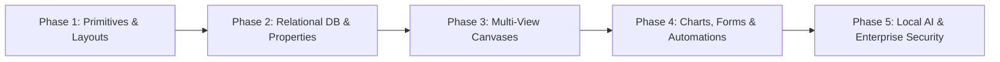

# Medha macOS: Notion Tier 1 & 2 Implementation Plan (5-Phase Roadmap)

> **Status**: Approved Execution Roadmap  
> **Scope**: High-ROI, 100% Offline, Native macOS Features (Tier 1 & Tier 2 Only)  
> **Target Platform**: macOS 14.0+ (Swift 5.9+, AppKit, SwiftUI, GRDB SQLite, Swift Charts)  
> **Reliability Goal**: 60–120 FPS, <30MB Memory Footprint, 0% Crash Hazards  

---

## 📑 Executive Summary

Following the comprehensive architectural analysis of the Notion Workspace Platform, this plan extracts **only Tier 1 and Tier 2 features**—excluding all heavy WebKit runtimes, unvetted background daemons, and crash-prone execution sandboxes. 

Every feature in this roadmap is designed for **native Apple Silicon performance**:
- **Pure GRDB SQLite persistence**: Zero cloud dependency; sub-millisecond local queries.
- **Native AppKit & SwiftUI rendering**: Direct hardware acceleration via Metal; no web wrappers or Electron bloat.
- **Offline-First Integrity**: Instant reactivity, seamless local file attachments, and complete privacy.

The implementation is structured into **5 logical phases**, sequenced by architectural dependency:



---

## 🗺️ Feature Inventory by Tier

### 🟢 Tier 1 Features (Pure Swift Native / Zero Risk)
1. **Document Block Primitives**:
   - `toggle` (Collapsible disclosure container).
   - `heading_1`, `heading_2`, `heading_3` (with collapsible toggle chevrons).
   - `bulleted_list_item`, `numbered_list_item` (with auto-indentation and incrementing sequence).
   - `to_do_list_item` (Task completion checkbox with strikethrough styling).
   - `quote` (Vertical accent excerpt) & `callout` (Icon glyph and colored tint card).
   - `divider` (Horizontal separator).
2. **Scalar Database Properties**:
   - `title`, `rich_text`, `number`, `checkbox`, `select`, `multi_select`, `status`, `date`, `url`, `email`, `phone_number`.
   - `unique_id` (Deterministic sequential issue IDs like `MED-101`).
   - `created_time`, `created_by`, `last_edited_time`, `last_edited_by` (Automatic audit metadata).
   - `people` (Workspace member / author identity pointer).
3. **Record Layout & Customization**:
   - **Pinned Bar**: Horizontal chip strip pinning up to 15 properties.
   - **Tabbed Layout**: Segmented tabs (Overview, Specs, Tasks, Notes).
   - **Collapsible Property Sections**: Foldable metadata groups.
   - **Backlink Visibility Toggles**: Always show, hover, or conceal.
4. **Governance & Export**:
   - **Page Verification**: 30/90/365-day certification badges with search boost.
   - **Document Egress Toggles**: Read-only protection mode.
   - **Local Import / Export**: Clean JSON and Markdown disk serialization.

### 🔵 Tier 2 Features (Moderate macOS Architecture / <1% Risk)
1. **Relational Database Engine**:
   - `relation`: Directed foreign keys via SQLite junction table (`record_relations`).
   - `rollup`: Automated SQL join reductions (`SUM`, `AVG`, `COUNT`, `PERCENT`, `MIN`, `MAX`).
   - `files`: Sandboxed local attachment storage with SHA-256 hashes and image preview cards.
2. **Database Views**:
   - **Table View**: AppKit `NSTableView` with resizable columns, frozen title column, and bottom calc row.
   - **Board View (Kanban)**: Multi-column swimlanes with native `NSItemProvider` drag-and-drop.
   - **Gallery View**: Image-forward card grid with customizable cover cards.
   - **Calendar View**: Monthly and multi-week matrix view via `Calendar.current`.
3. **Visual Analytics**:
   - **Native Chart Engine via Swift Charts**: Vertical bar, horizontal bar, line, donut/sector, and KPI number cards.
4. **Interactive Controls & Automations**:
   - **Local Form Sheets**: Modal intake sheets mapping properties to database records.
   - **Page & Database Buttons**: Clickable automation triggers.
   - **Internal Triggers & Actions**: SQLite `TransactionObserver` driving internal cascade mutations.
   - **Conditional Branching Form Logic**: State-driven field visibility rules.
5. **AI Productivity & Utilities**:
   - **Inline AI (`/ai` & Spacebar)**: Streaming text generation, summaries, tone shifting, and action extraction.
   - **AI Autofill Columns**: Background task generating summaries or key entity tags on save.
   - **Link Previews (Unfurling)**: Asynchronous Open Graph metadata caching (`og:title`, `og:image`).
   - **Lightweight Table Block (`table`)**: Non-database lightweight row/column grid.
   - **Code Editor (`code`)**: Native Tree-sitter / Splash syntax highlighting without web runtimes.
   - **Local Database Encryption & Audit Log**: AES-GCM Keychain vault & append-only SQLite audit ledger.

---

## 🚀 The 5-Phase Implementation Plan

---

### 📦 Phase 1: Typographical Primitives, Advanced Block Types & Record Layouts

**Goal**: Elevate Medha's existing `Block` model and `BlockEditorView` with Notion-grade disclosure containers, rich structural blocks, and modular record headers.

#### 1.1 Document Block Primitives
- **`toggle` Block**:
  - Add `isCollapsed: Bool?` to `Block.swift`.
  - When collapsed, child blocks with `parentId == block.id` are hidden from the layout.
  - Render an interactive AppKit chevron button (`chevron.right` rotating to `chevron.down`).
- **Collapsible Headings (`heading1`, `heading2`, `heading3`)**:
  - Add optional toggle disclosure to headings.
  - Folding a heading collapses all subsequent sibling blocks until a heading of equal or higher tier is encountered.
- **Lightweight Tabular Grid Block (`table`)**:
  - Non-database row/column grid.
  - Store content as lightweight 2D JSON matrix `[[String]]` in `Block.content`.
  - AppKit table-like inline text navigation: `Tab` moves to next cell, `Enter` creates new row.
- **Syntax-Highlighted Code Block (`code`)**:
  - Integrate native Swift Tree-sitter or `Splash` for zero-dependency syntax highlighting (Swift, Python, JS, C++, SQL, Rust, Go, Bash).
  - Include copy-to-clipboard button and language badge.
- **Enhanced Quotes & Callouts**:
  - Customizable emoji/icon picker (`systemIcon`).
  - Customizable background tint (neutral, blue, green, amber, rose, purple).

#### 1.2 Record UI & Layout Customization Framework
- **Pinned Property Bar**:
  - Horizontal chip strip rendering directly below the document title in `BlockEditorView`.
  - Allows pinning up to 15 key properties for rapid glanceability.
  - Horizontal scrolling via `ScrollView(.horizontal, showsIndicators: false)` with overflow gradient scrims.
- **Tabbed Record Layout**:
  - Allow document records to partition content into horizontal tabs (`Overview`, `Specifications`, `Tasks`, `Logs`).
  - Implemented using native macOS segmented picker:
    ```swift
    Picker("Record Tab", selection: $selectedTab) {
        ForEach(recordTabs, id: \.self) { tab in
            Text(tab.name).tag(tab)
        }
    }
    .pickerStyle(.segmented)
    ```
- **Collapsible Property Sections**:
  - Group specialized metadata into native `DisclosureGroup` sections inside the document header or sidebar.
- **Page Verification & Badges**:
  - Add `verifiedAt: Date?`, `verifiedExpiresAt: Date?`, and `verifiedBy: String?` to document metadata.
  - Preset expiry intervals: 30 days, 90 days, 365 days.
  - Render a verification badge with tooltip; apply a boost multiplier in `SearchService` (SQLite FTS5).
- **Document Egress Policies**:
  - Read-only document lock toggle in the document options menu, disabling edits and exports.

---

### 🗄️ Phase 2: Relational Database Core & Typed Properties Engine

**Goal**: Build a schema-governed database engine directly on top of GRDB SQLite, supporting 16 property types, bidirectional relations, and rollups.

#### 2.1 Database Schema & SQLite Migration (v10 Migration)
Create dedicated tables in `DatabaseMigrations.swift`:
```sql
CREATE TABLE databases (
    id TEXT PRIMARY KEY NOT NULL,
    rootDocId TEXT NOT NULL REFERENCES documents(id) ON DELETE CASCADE,
    title TEXT NOT NULL,
    description TEXT,
    createdAt DATETIME NOT NULL,
    updatedAt DATETIME NOT NULL
);

CREATE TABLE database_properties (
    id TEXT PRIMARY KEY NOT NULL,
    databaseId TEXT NOT NULL REFERENCES databases(id) ON DELETE CASCADE,
    name TEXT NOT NULL,
    type TEXT NOT NULL, -- title, richText, number, select, multiSelect, status, date, people, files, checkbox, url, email, phone, relation, rollup, createdTime, createdBy, lastEditedTime, lastEditedBy, uniqueId
    configJson TEXT,    -- Options list, colors, relation targetId, rollup formula
    sortOrder INTEGER NOT NULL DEFAULT 0
);

CREATE TABLE database_records (
    id TEXT PRIMARY KEY NOT NULL,
    databaseId TEXT NOT NULL REFERENCES databases(id) ON DELETE CASCADE,
    docId TEXT NOT NULL REFERENCES documents(id) ON DELETE CASCADE,
    uniqueSeqNumber INTEGER,
    createdAt DATETIME NOT NULL,
    updatedAt DATETIME NOT NULL
);

CREATE TABLE database_cell_values (
    recordId TEXT NOT NULL REFERENCES database_records(id) ON DELETE CASCADE,
    propertyId TEXT NOT NULL REFERENCES database_properties(id) ON DELETE CASCADE,
    valueText TEXT,
    valueNumber REAL,
    valueDate DATETIME,
    valueJson TEXT,
    PRIMARY KEY (recordId, propertyId)
);

CREATE TABLE record_relations (
    id TEXT PRIMARY KEY NOT NULL,
    fromRecordId TEXT NOT NULL REFERENCES database_records(id) ON DELETE CASCADE,
    toRecordId TEXT NOT NULL REFERENCES database_records(id) ON DELETE CASCADE,
    relationPropertyId TEXT NOT NULL REFERENCES database_properties(id) ON DELETE CASCADE
);
```

#### 2.2 Property Types Implementation
- **Scalar Types**: `rich_text`, `number` (with currency/percent formatting), `checkbox`, `date` (ISO 8601 with optional time & range), `url`, `email`, `phone_number`.
- **Categorical Badges**:
  - `select`: Single-choice colored badge from a predefined taxonomy dictionary.
  - `multi_select`: Array of tags with independent color tokens.
  - `status`: Grouped lifecycle states (`To-do`, `In Progress`, `Complete`).
- **Deterministic Sequences**:
  - `unique_id`: Prefix string (e.g. `TASK-`, `BUG-`) + SQLite auto-incrementing integer.
- **Relational Graph & Rollups**:
  - `relation`: Directed pointer linking records between two databases via `record_relations`.
  - `rollup`: Automated aggregate calculation over relations. GRDB computes this in sub-millisecond queries:
    ```sql
    SELECT 
        CASE :aggregation
            WHEN 'sum' THEN SUM(c.valueNumber)
            WHEN 'avg' THEN AVG(c.valueNumber)
            WHEN 'count' THEN COUNT(c.recordId)
            WHEN 'min' THEN MIN(c.valueNumber)
            WHEN 'max' THEN MAX(c.valueNumber)
        END AS rollupResult
    FROM record_relations r
    JOIN database_cell_values c ON c.recordId = r.toRecordId AND c.propertyId = :targetPropId
    WHERE r.fromRecordId = :currentRecordId;
    ```
- **Files & Local Asset Storage**:
  - Stored locally in `~/Library/Application Support/Medha/Attachments/` with SHA-256 content hashes.
  - Thumbnails cached asynchronously for image cards.

---

### 🖥️ Phase 3: Multi-View Database Canvases

**Goal**: Deliver the 4 primary visual layouts for database records using native macOS collection and table components.

#### 3.1 Table View (`NSTableView`)
- **AppKit Native Performance**:
  - Wrapped via `NSViewRepresentable` to handle thousands of records with zero virtual-DOM overhead.
  - Resizable column dividers with persistent width state in SQLite.
  - Frozen primary identifier column (Title) during horizontal scrolling.
  - Bottom summary calculation row (Sum, Average, Min, Max, Count).

#### 3.2 Board View (Kanban Swimlanes)
- **Swimlane Architecture**:
  - Group columns dynamically by `select`, `status`, or `people` property.
  - Horizontally scrolling stack of vertical cards.
- **macOS Native Drag-and-Drop**:
  - Integrated via `onDrag` and `onDrop` using `NSItemProvider`.
  - Dragging a card into a new column immediately executes an atomic SQLite transaction updating the column value and refreshing both views.

#### 3.3 Gallery View
- **Image-Forward Card Matrix**:
  - Adaptive grid (`LazyVGrid(columns: [GridItem(.adaptive(minimum: 220))])`).
  - Card cover image extracted from file attachments, page cover, or body blocks.
  - Visible property badges displayed as pills along the bottom card footer.

#### 3.4 Calendar View
- **Multi-Week & Monthly Matrix**:
  - Built with native Swift `Calendar` calculations.
  - Records mapped onto days matching their `date` property.
  - Supports spanning multi-day ranges (`date.start` to `date.end`).
  - Click-and-drag to adjust record dates directly on the calendar grid.

---

### 📊 Phase 4: Native Visual Analytics, Forms & Workflow Automations

**Goal**: Integrate Apple's hardware-accelerated charting engine, local intake forms, and an event-driven automation pipeline.

#### 4.1 Native Visual Charting via Swift Charts (`import Charts`)
- **Supported Chart Layouts**:
  1. **Vertical Bar Chart**: Categorical comparisons.
  2. **Horizontal Bar Chart**: Ranked distributions and long label lists.
  3. **Line Chart**: Temporal progress over dates with optional spline smoothing.
  4. **Donut / Sector Chart**: Part-to-whole categorical proportions.
  5. **KPI Number Card**: Large scalar metrics with percentage change indicators.
- **Pipeline**:
  - Query records from GRDB SQLite.
  - Group by primary property (X-axis) and secondary subgroup.
  - Execute aggregations (`count`, `sum`, `avg`, `median`, `min`, `max`).
  - Render via 120 FPS Metal-accelerated `Swift Charts`.

#### 4.2 Native Local Forms & Conditional Logic
- **Form Intake Sheet**:
  - Clean SwiftUI sheet allowing structured record entry into any database.
  - Supports field validation (required fields, regex for email/phone, number ranges).
  - Field descriptions and independent field labels without altering database property names.
- **Conditional Branching Logic**:
  - Dynamic question reveal based on antecedent answers (e.g. if `Category == "Bug"`, show `Severity` picker).

#### 4.3 Page Buttons & Workflow Automations
- **Page & Database Button Blocks**:
  - Interactive button block triggering a pre-configured action sequence (e.g., "Duplicate Template", "Mark as Completed & Set Archive Date").
- **SQLite Trigger & Action Engine**:
  - Implement a dedicated `AutomationService` listening to GRDB `TransactionObserver`.
  - **Triggers**: Record created, status changed to X, date equals today.
  - **Actions**: Update internal properties, generate child blocks from template, link related records.
  - **Loop Prevention Guard**: Strict max-depth counter (limit 5) to prevent infinite cascading trigger loops.

---

### 🧠 Phase 5: Local AI Intelligence, Link Previews & Security Governance

**Goal**: Ground Notion's AI and security capabilities in Medha's 100% offline, local-first paradigm.

#### 5.1 Inline AI & AI Autofill Columns
- **Inline Assistant (`/ai` and Spacebar)**:
  - Accessible directly at any block boundary.
  - Actions: Summarize section, fix grammar, shift tone (academic, concise, professional), extract action items into to-dos.
  - Routes directly to Medha's existing `AISocraticService` (local offline Ollama models or isolated API keys).
- **AI Autofill Database Properties**:
  - Database columns that populate automatically upon record modification:
    - `AI Summary`: Automatically generates an abstract of the page content.
    - `AI Key Info`: Extracts key entities, blockers, or deadlines.
    - `Custom AI Prompt`: Evaluates a custom prompt across the record body.
  - Debounced background tasks that do not lock the UI thread.

#### 5.2 Link Previews & Unfurling
- **Rich Open Graph Cards**:
  - When a URL is pasted, fetch metadata asynchronously in the background (`og:title`, `og:description`, `og:image`).
  - Render as a sleek compact preview card with favicon and domain label.
  - Cache metadata in SQLite to eliminate redundant network requests.

#### 5.3 Local Security & Audit Governance
- **Keychain-Backed Database Encryption**:
  - Store SQLite encryption keys securely in Apple Keychain.
  - Support full database-at-rest encryption via SQLCipher.
- **Local Append-Only Audit Ledger**:
  - Record history of modifications (timestamp, action, record ID, user).
  - Useful for tracking revisions and undoing accidental bulk operations.

---

## 📅 Execution Roadmap & Verification Milestones

| Phase | Duration | Core Deliverables | Verification Strategy |
| :---: | :---: | :--- | :--- |
| **Phase 1** | Week 1–2 | Toggles, collapsible headings, lightweight tables, Tree-sitter code blocks, Pinned Bar, Tabbed layout, Page verification. | 1. Unit tests in `MedhaTestRunner` for toggle state serialization.<br />2. Visual verification of AppKit chevrons and segmented tabs. |
| **Phase 2** | Week 3–4 | SQLite migration v10, 16 typed properties, relation junction tables, rollup SQL aggregations, local file attachments. | 1. Test suite validating foreign key cascade deletions.<br />2. Sub-millisecond rollup benchmarks across 1,000+ related records. |
| **Phase 3** | Week 5–6 | NSTableView Table view with frozen columns, Kanban Board with drag-and-drop, Gallery card grid, Calendar view. | 1. UI test for drag-and-drop status mutation.<br />2. 60 FPS scrolling benchmarks on 5,000 database records. |
| **Phase 4** | Week 7–8 | Swift Charts engine (5 chart layouts), local intake form sheet with branching, button blocks, trigger automation actor. | 1. Validation of Metal chart rendering with dynamic filters.<br />2. Cascade loop prevention test for automated triggers. |
| **Phase 5** | Week 9–10 | Inline AI `/ai` menu, AI Autofill background evaluator, Open Graph unfurling, Keychain encryption, audit ledger. | 1. Test offline Ollama summarization to database column.<br />2. Verify zero main-thread hitching during background AI saves. |

---

## 🛡️ Anti-Bloat Guardrails (What We Exclude)

To preserve Medha's battery efficiency, sub-30MB memory footprint, and instantaneous responsiveness, the following are strictly excluded:
1. ❌ **No WebViews for blocks**: LaTeX uses native `Swift-Math`, code uses native Tree-sitter, and tables use native AppKit.
2. ❌ **No Sandboxed MicroVMs ("Notion Computer")**: Untrusted code execution belongs in external developer tools, not inside a personal knowledge application.
3. ❌ **No Open Web Server Daemons**: Forms and pages are edited and viewed locally; no live public HTTP tunnels that compromise local security.
4. ❌ **No Multi-Tenant Enterprise SAML/SCIM**: Kept 100% focused on personal cognitive retention.
