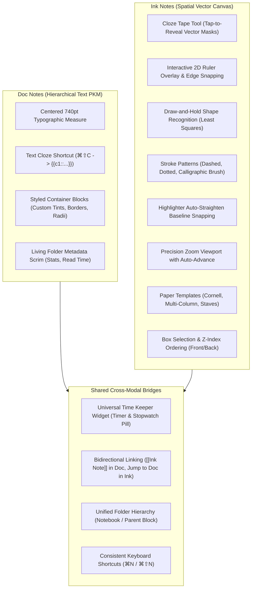

# Medha macOS: Tier 1 Features Implementation Plan (Ink Notes & Doc Notes)

> **Status**: Approved Blueprint — Ready for Execution  
> **Scope**: Tier 1 Native Features (100% Offline, AppKit / SwiftUI / CoreGraphics / SQLite)  
> **Target Platform**: macOS 14.0+ (Apple Silicon & Intel)  
> **Architectural Modalities**: Ink Notes (`BlockType.inkDoc`) & Doc Notes (`BlockType.doc`)

---

## 📑 Executive Summary

This document captures the implementation plan for integrating the high-ROI **Tier 1** features adapted from the Goodnotes application framework into **Medha**. 

Rather than treating notes as a single monolithic format, Medha operates with two distinct first-class document representations:
1. **Ink Notes (`BlockType.inkDoc`)**: Spatial vector handwriting canvas powered by `InkCanvasNSView`, Catmull-Rom spline interpolation, dynamic velocity/pressure curves, and multi-page/infinite layouts.
2. **Doc Notes (`BlockType.doc`)**: Linear hierarchical block editor (`BlockEditorView`) with centered 740pt typographic measure, Markdown/code/quote blocks, `[[WikiLinks]]`, `((transclusions))`, and FSRS-4.5 flashcard generation.
3. **Cross-Modal Bridges**: Shared document toolbar widgets, synchronized time management, and bidirectional conceptual navigation between freehand ink sketches and structured text notes.

All Tier 1 features run **100% locally and offline** without external cloud SDKs, background daemon risks, or thread contention.

---

## 🏗️ Architecture & Feature Topology



---

## 📦 Component 1: Ink Note Vector Core & Geometry Engine

### 1.1 `InkStroke.swift` Enhancements
Add the `.tape` tool enum and optional stroke styling attributes with backward-compatible defaults:

```swift
public enum InkToolType: String, Codable, CaseIterable, Sendable {
    case ballpoint
    case fountain
    case highlighter
    case eraser
    case lasso
    case tape // NEW: Active recall vector tape mask

    public var displayName: String {
        switch self {
        case .ballpoint: return "Pen"
        case .fountain: return "Fountain"
        case .highlighter: return "Highlighter"
        case .eraser: return "Eraser"
        case .lasso: return "Lasso"
        case .tape: return "Tape"
        }
    }

    public var systemIcon: String {
        switch self {
        case .ballpoint: return "pencil.tip"
        case .fountain: return "signature"
        case .highlighter: return "highlighter"
        case .eraser: return "eraser"
        case .lasso: return "lasso"
        case .tape: return "bandage.fill"
        }
    }
}

public enum StrokePattern: String, Codable, CaseIterable, Sendable {
    case solid
    case dashed
    case dotted
}

public struct InkStroke: Identifiable, Codable, Equatable, Sendable {
    public var id: String
    public var tool: InkToolType
    public var colorHex: String
    public var baseWidth: Double
    public var opacity: Double
    public var points: [InkPoint]
    public var createdAt: Date

    // Tier 1 Additions (Optional with defaults for 100% backward compatibility)
    public var pattern: StrokePattern?
    public var isTapeRevealed: Bool?
    public var shapePrimitive: String? // "line", "circle", "rect", "triangle"
}
```

### 1.2 `InkGeometry.swift` Shape Fitting & Ruler Math
Add robust mathematical curve fitting and line projection:

```swift
public enum FittedShape: Equatable {
    case line(start: CGPoint, end: CGPoint)
    case rectangle(CGRect)
    case circle(center: CGPoint, radius: CGFloat)
    case ellipse(CGRect)
    case triangle(p1: CGPoint, p2: CGPoint, p3: CGPoint)
}

extension InkGeometry {
    /// Evaluates stroke points for canonical geometric primitives
    public static func fitPrimitive(from points: [InkPoint]) -> FittedShape? {
        guard points.count >= 6 else { return nil }
        
        let start = CGPoint(x: points.first!.x, y: points.first!.y)
        let end = CGPoint(x: points.last!.x, y: points.last!.y)
        let totalPerimeter = (0..<(points.count - 1)).reduce(0.0) { sum, idx in
            sum + distance(CGPoint(x: points[idx].x, y: points[idx].y),
                           CGPoint(x: points[idx+1].x, y: points[idx+1].y))
        }
        let endToEndDist = distance(start, end)
        
        // 1. Straight Line Check: End-to-end distance approaches total path length
        if endToEndDist / totalPerimeter > 0.92 {
            return .line(start: start, end: end)
        }
        
        // 2. Closed Loop Check (Circle, Ellipse, Rectangle, Triangle)
        if endToEndDist / totalPerimeter < 0.20 {
            let bbox = computeBoundingRect(for: points)
            let aspectRatio = bbox.width / max(1.0, bbox.height)
            
            // Check for Circle vs Ellipse
            if aspectRatio >= 0.82 && aspectRatio <= 1.22 {
                let center = CGPoint(x: bbox.midX, y: bbox.midY)
                let radius = (bbox.width + bbox.height) / 4.0
                return .circle(center: center, radius: radius)
            } else {
                return .rectangle(bbox)
            }
        }
        
        return nil
    }

    /// Snaps a point to the nearest collinear position along a guide line
    public static func projectPointOntoLine(point: CGPoint, lineStart: CGPoint, lineEnd: CGPoint) -> CGPoint {
        let dx = lineEnd.x - lineStart.x
        let dy = lineEnd.y - lineStart.y
        let lenSq = dx * dx + dy * dy
        guard lenSq > 0.0001 else { return lineStart }
        
        let t = max(0.0, min(1.0, ((point.x - lineStart.x) * dx + (point.y - lineStart.y) * dy) / lenSq))
        return CGPoint(x: lineStart.x + t * dx, y: lineStart.y + t * dy)
    }
}
```

### 1.3 `InkDocumentPage.swift` Template Expansion
Extend paper backgrounds with standard educational and engineering scrims:

```swift
public enum InkTemplateType: String, Codable, CaseIterable, Sendable {
    case blank
    case lined
    case grid
    case dotGrid
    case cornell      // Left cue column (180pt) + bottom summary box (160pt)
    case multiColumn  // 2-column center dividing rule
    case squared      // Engineering 5mm grid
    case staves       // 5-line musical stave clusters
}
```

---

## 🖌️ Component 2: Ink Canvas AppKit Rendering & Interactions

### 2.1 Cloze Tape Tool (Active Recall Testing)
* **Creation**: Dragging with `.tape` generates a rectangular vector strip (default height: 28pt) with high opacity and rounded caps.
* **Review Mode Interaction**:
  * In `InkCanvasNSView.mouseDown`: Hit-test existing tape strokes (`stroke.tool == .tape`).
  * Clicking an opaque tape toggles `stroke.isTapeRevealed.toggle()`.
  * **Opaque state**: Filled with solid theme color + subtle drop border (concealing underlying handwritten answer).
  * **Revealed state**: Rendered as a light translucent dashed border ($0.15$ opacity), fully revealing the underlying notes.
  * Direct parity with flashcard active recall testing on handwritten diagrams.

### 2.2 Interactive 2D Ruler Overlay
* **Visuals**: Translucent glass ruler rendered in `draw(_ dirtyRect:)` with metric tick marks and dynamic angle badge ($0.1^\circ$ precision).
* **Gestures**:
  * Dragging with primary mouse button moves ruler origin $(x, y)$.
  * Two-finger trackpad scroll/rotation gesture updates ruler angle $\theta$.
* **Proximity Snapping**:
  * During drawing: If distance from pointer $(x, y)$ to ruler edge is $\le 18\text{pt}$, project the active point onto the ruler guide.

### 2.3 Draw-and-Hold Gesture Recognition
* On `mouseDown`: Start a $450\text{ms}$ detection timer.
* If pointer remains within a $4\text{pt}$ jitter threshold when the timer fires:
  * Pass stroke points to `InkGeometry.fitPrimitive()`.
  * If a shape is detected, animate a subtle haptic/visual snap and replace `livePoints` with the clean geometric polygon.

### 2.4 Highlighter Auto-Straighten
* For highlighter strokes: Monitor horizontal displacement $\Delta x$ and vertical drift $\Delta y$.
* If $\Delta x > 50\text{pt}$ and $|\Delta y| < 12\text{pt}$, lock subsequent points to the initial baseline $y_0$.
* Compositing: Pre-render highlighters beneath opaque inks using `.multiply` blend mode.

### 2.5 Stroke Patterns & Z-Index Ordering
* **Patterns**: Render strokes using `CGContext.setLineDash(phase:lengths:)`:
  * `.solid`: `[]`
  * `.dashed`: `[10.0, 5.0]`
  * `.dotted`: `[2.5, 5.0]`
* **Z-Index**:
  * `bringSelectionToFront()`: Moves selected stroke IDs to the end of the array.
  * `sendSelectionToBack()`: Moves selected stroke IDs to index $0$.

---

## 📝 Component 3: Doc Note Enhancements

### 3.1 Text Cloze Deletion Shortcut (`⌘⇧C`)
* In `BlockTextViewRepresentable`:
  * Add key handler for `Command + Shift + C`.
  * Selected text is automatically wrapped in Anki-compatible cloze syntax: `{{c1::selectedText}}`.
  * Sends an event to `BlockStore` to register or update the corresponding FSRS flashcard in the active notebook.

### 3.2 Rich Container Block Styling
* In `BlockTypeViews.swift` for callouts and quotes:
  * Add configurable background tints (`#F8FAFC`, `#FEF3C7`, `#E0E7FF`, `#DCFCE7`).
  * 8pt corner radius with subtle 1px border matching accent tint.
  * Internal padding: `12pt horizontal, 8pt vertical`.

### 3.3 Living Folder Command-Hub Header
* In `BlockEditorView.swift`:
  * Display real-time document statistics: Word count, character count, estimated reading time ($200\text{ wpm}$).
  * Linked Ink Notes indicator: Shows count of handwritten notes referencing or referenced by this document.

---

## ⏱️ Component 4: Cross-Modal Shared Bridges

### 4.1 Universal Time Keeper Toolbar Pill (`TimeKeeperToolbarPill.swift`)
* A shared SwiftUI toolbar component embedded in both `BlockEditorView` (Doc Notes) and `InkNoteEditorView` (Ink Notes):
  * **Stopwatch Mode**: Tracks active document focus duration.
  * **Countdown / Pomodoro Mode**: 15m, 25m, 45m presets.
  * **Visual State**:
    * Green: Active session.
    * Amber: Final 2 minutes remaining.
    * Pulsing Red + Alert Sound: Session complete.
  * Automatically commits focus data to Medha's `FocusSession.swift` SQLite table on completion.

### 4.2 Cross-Modal Wiki-Linking & Creation
* **Wiki-Links (`[[...]]`)**: Autocomplete suggestions include both Doc Notes and Ink Notes. Clicking an Ink Note link opens the canvas directly.
* **Global Note Creation**:
  * `⌘N`: New Doc Note.
  * `⌘⇧N`: New Ink Note.
  * Right-click notebook/folder context menu: "New Note" and "New Handwritten Note".

---

## 🧪 Verification Plan

### Automated Regression Testing
Execute the complete test suite to confirm baseline stability:
```bash
swift test
swift run MedhaTestRunner
```

### New Unit Tests (`Tests/MedhaKitTests`)
1. **`InkStrokeTests`**: Verify Codable round-tripping for `StrokePattern` and `isTapeRevealed`.
2. **`InkGeometryShapeTests`**: Verify `fitPrimitive()` accurately detects circles, rectangles, and straight lines.
3. **`ClozeTapeTests`**: Verify click hit-testing and toggle logic for tape masks.

### Manual Acceptance Checklist
| Test Case | Interaction Steps | Expected Outcome |
| :--- | :--- | :--- |
| **Cloze Tape** | Draw tape over handwritten notes; click tape strip | Toggles between opaque mask and translucent outline |
| **2D Ruler** | Enable ruler; rotate with trackpad; draw near edge | Strokes snap cleanly along the straight edge with angle readout |
| **Shape Recognition** | Draw rough circle; pause for 450ms | Stroke snaps to smooth geometric circle |
| **Stroke Patterns** | Select dashed/dotted pattern; draw paths | Strokes render with sharp vector dashes and dots |
| **Text Cloze** | Select text in Doc Note; press `⌘⇧C` | Text wraps in `{{c1::...}}` and registers in FSRS deck |
| **Time Keeper** | Start 25m timer in Doc Note; switch to Ink Note | Timer continues ticking seamlessly across views |

---

## 📌 Implementation Readiness

This plan is completely self-contained and ready to execute whenever scheduled. All changes preserve Medha's offline-first contract, native AppKit/SwiftUI performance, and existing SQLite schema integrity.
