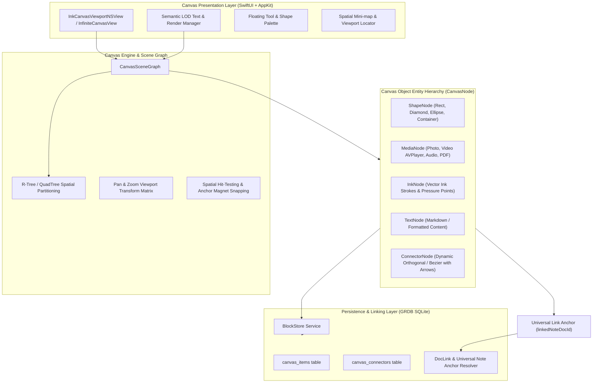

# 🌌 Medhara Unified Infinite Canvas Specification & Master Implementation Prompt

> **Architecture Vision:** A high-performance, hardware-accelerated 2D Infinite Canvas for macOS (Swift, SwiftUI/AppKit, CoreGraphics/Metal, GRDB) that unifies handwriting/ink, rich media (photos, videos, audio, PDF embeds), flowchart shapes, dynamic connectors, semantic Level-of-Detail (LOD) zooming, and universal bidirectional note linking.

---

## 1. System Architecture Overview



---

## 2. Core Data Models (GRDB / Swift)

### 2.1 Unified Canvas Item Model (`CanvasItem`)
```swift
import Foundation
import GRDB
import CoreGraphics

public enum CanvasItemType: String, Codable, Sendable {
    case shape       // Rectangle, Rounded, Diamond, Ellipse, Group/Container
    case mediaImage  // PNG, JPEG, HEIC, WebP, GIF
    case mediaVideo  // MP4, MOV (AVPlayerLayer)
    case mediaAudio  // Voice note, MP3, M4A
    case mediaPDF    // PDF Kit Single / Multi-page embed
    case textBlock   // Rich text / Markdown block
    case noteCard    // Standard Medhara note card
}

public enum FlowchartShapeType: String, Codable, Sendable {
    case rectangle
    case roundedRectangle
    case diamond
    case ellipse
    case containerGroup
}

public struct CanvasItem: Identifiable, Codable, FetchableRecord, PersistableRecord, Equatable, Sendable {
    public var id: String                          // "item-\(UUID())"
    public var canvasDocId: String                 // Parent canvas document
    public var itemType: CanvasItemType            // Type of canvas object
    
    // Geometry & Transform in Canvas Space (Infinite 2D Coordinates)
    public var x: Double
    public var y: Double
    public var width: Double
    public var height: Double
    public var rotationDegrees: Double             // Default 0.0
    public var zIndex: Int                         // Rendering stack order
    
    // Universal Note Linking
    public var linkedNoteDocId: String?            // Optional link anchor to any Medhara Note Document
    public var linkAnchorLabel: String?            // Display label or badge override
    
    // Shape & Visual Styling
    public var shapeType: FlowchartShapeType?      // If itemType == .shape
    public var fillColorHex: String?               // e.g. "#1E293B", "#3B82F6"
    public var strokeColorHex: String?             // e.g. "#64748B"
    public var strokeWidth: Double                 // e.g. 2.0
    public var cornerRadius: Double                // e.g. 12.0
    
    // Embedded Content & Semantic LOD
    public var title: String?                      // High-level title visible at all zoom levels
    public var summarySnippet: String?             // Medium zoom preview snippet
    public var markdownContent: String?            // Full content rendered when zooming close
    
    // Media Metadata (for media items)
    public var mediaAssetKey: String?              // Local sandbox storage key
    public var mediaMimeType: String?              // "image/png", "video/mp4", etc.
    public var mediaDurationSeconds: Double?       // For video / audio
    
    // Timestamps
    public var createdAt: Date
    public var updatedAt: Date

    public var boundingRect: CGRect {
        CGRect(x: x, y: y, width: width, height: height)
    }
}
```

### 2.2 Smart Dynamic Connectors (`CanvasConnector`)
```swift
public enum ConnectorRoutingType: String, Codable, Sendable {
    case orthogonal    // Manhattan 90-degree step routing
    case curvedBezier  // Smooth cubic Bezier curve
    case straightLine  // Direct vector line
}

public enum ConnectorEndCap: String, Codable, Sendable {
    case none
    case standardArrow
    case filledDiamond
    case circle
}

public struct CanvasConnector: Identifiable, Codable, FetchableRecord, PersistableRecord, Equatable, Sendable {
    public var id: String                          // "conn-\(UUID())"
    public var canvasDocId: String
    
    // Source & Target Anchors
    public var sourceItemId: String
    public var sourceAnchorSide: String            // "top", "right", "bottom", "left", "center"
    public var targetItemId: String
    public var targetAnchorSide: String            // "top", "right", "bottom", "left", "center"
    
    // Routing & Styling
    public var routingType: ConnectorRoutingType   // .orthogonal, .curvedBezier, .straightLine
    public var strokeColorHex: String              // e.g. "#94A3B8"
    public var strokeWidth: Double                 // e.g. 2.5
    public var isDashed: Bool                      // Flowchart dashed line support
    public var startCap: ConnectorEndCap           // .none, .circle
    public var endCap: ConnectorEndCap             // .standardArrow
    
    // Optional Connector Label / Condition
    public var label: String?                      // e.g. "Yes", "No", "Error", "Next Phase"
    
    public var createdAt: Date
    public var updatedAt: Date
}
```

---

## 3. Semantic Level-of-Detail (LOD) Rendering Specification

The infinite canvas uses a 3-tier Semantic Level-of-Detail (LOD) engine driven by the current viewport zoom level $Z$:

| Zoom Level $Z$ | LOD State | Rendered Presentation |
|---|---|---|
| $Z < 0.35$ (Far Macro Overview) | **Macro / Blueprint LOD** | Simplified silhouette, high-contrast shape outline, color-coded fill, node title, badge showing `[🔗 Note Attached]`. Connectors rendered as clean simplified vectors. Minimizes layout computation. |
| $0.35 \le Z < 1.0$ (Normal Flowchart Nav) | **Summary LOD** | Shape icon, bold title, 2–3 line summary snippet, media thumbnail preview, interactive quick-jump link pill badge. |
| $Z \ge 1.0$ (Deep Dive / Zoomed In) | **Micro / Full Rich Detail LOD** | Smoothly dissolves into full rendered markdown, multi-column blocks, media scrub controls (play/pause video, scrub bar), interactive checkboxes, and in-place note expansion without modal switching. |

---

## 4. Universal Link Anchor Behavior

Every canvas node (Flowchart Shape, Media thumbnail, Ink Section, Text Block, Group) can be linked to any note in the user's Medhara PKM knowledge vault:
1. **Visual Anchor Pill:** When `linkedNoteDocId != nil`, the node displays a sleek, translucent floating badge (e.g. `🔗 Deep Learning Architecture`).
2. **Click Interaction:** Clicking the badge immediately reveals a rich interactive popover preview or smoothly animates the camera/navigation to the referenced document.
3. **Double Click / Context Menu:** Right-clicking opens `Link Note...`, displaying Medhara's fuzzy note search with real-time autocompletion.
4. **Bidirectional Knowledge Graph Integration:** Linking an object on the canvas automatically registers a bidirectional link (`DocLink`) in the database so it appears in Medhara's Global Knowledge Graph and Backlinks panel.

---

## 5. Media Ingestion Pipeline

1. **Drag-and-Drop & Clipboard Paste:**
   - Supported inputs: Dragging files from macOS Finder, dragging from web browser, or `Cmd + V` pasting images/videos from clipboard.
   - Formats handled:
     - **Images:** PNG, JPEG, HEIC, WebP, GIF, SVG.
     - **Videos:** MP4, MOV (backed by native AppKit `AVPlayerView` / `AVPlayerLayer` with autoplay-on-hover / mute toggles).
     - **Audio:** MP3, M4A, WAV (with visual soundwave scrubbing bar).
     - **Documents:** PDF (single-page or multi-page flip preview using `PDFKit`).
2. **Local Sandboxed Storage (`PalaceAssetStorage` / `CanvasAssetStorage`):**
   - Media files are persisted directly into the app's application support directory: `Application Support/Medha/CanvasAssets/`.
   - Generates downscaled high-speed raster thumbnails for low-overhead rendering during panning and zooming.

---

## 6. Flowchart Geometry & Dynamic Connector Engine

1. **Magnet Anchors:**
   - Each shape exposes 4 cardinal connection ports (`top`, `right`, `bottom`, `left`) plus a center gravitating anchor.
   - When dragging a connector line near an anchor, visual halo magnet snapping engages automatically.
2. **Orthogonal (Manhattan) Auto-Routing:**
   - Computes path with minimal turns avoiding obstacle bounding boxes using A* or greedy rectilinear routing.
3. **Smooth Cubic Bezier Routing:**
   - $P_0$ (Source), $P_1 = P_0 + \vec{d}_1$, $P_2 = P_3 - \vec{d}_2$, $P_3$ (Target), guaranteeing tangent-aligned ingress/egress from shapes.
4. **Arrowhead Geometry:**
   - Sharp triangular endcaps drawn along the tangent vector of the termination point.

---

## 7. Master Prompt for AI Coding Agents

```markdown
You are an expert macOS Systems and Graphics Engineer specializing in Swift, AppKit, SwiftUI, CoreGraphics, AVFoundation, and GRDB SQLite.

### MISSION
Upgrade Medhara's canvas into a world-class, hardware-accelerated Unified Infinite Canvas supporting rich media import, flowchart shapes, smart dynamic connectors, universal note linking, and Semantic Level-of-Detail (LOD) zoom rendering.

### KEY SPECIFICATIONS TO IMPLEMENT:

1. DATABASE SCHEMA & PERSISTENCE (GRDB Migration)
   - Create tables `canvas_items` and `canvas_connectors` in `DatabaseMigrations.swift`.
   - Implement `CanvasItem` and `CanvasConnector` models with full CRUD in `BlockStore.swift`.
   - Ensure `CanvasItem` includes fields for `itemType` (.shape, .mediaImage, .mediaVideo, .mediaAudio, .mediaPDF, .textBlock, .noteCard), `linkedNoteDocId`, `shapeType`, geometry (`x`, `y`, `width`, `height`, `rotationDegrees`, `zIndex`), styling (`fillColorHex`, `strokeColorHex`, `strokeWidth`, `cornerRadius`), semantic content (`title`, `summarySnippet`, `markdownContent`), and `mediaAssetKey`.
   - Ensure foreign-key and cascade safety with parent `documents` table (`canvasDocId`).

2. MEDIA INGESTION & STORAGE PIPELINE
   - Implement `CanvasAssetStorage.swift` in `MedhaKit/Services/` to securely save dropped/pasted media into `Application Support/Medha/CanvasAssets/`.
   - Support Drag & Drop and Clipboard paste in `InkCanvasViewportNSView.swift` for:
     * Images: PNG, JPEG, HEIC, WebP, GIF
     * Videos: MP4, MOV (render thumbnail and embed lightweight AVPlayer on focus/zoom)
     * Audio: MP3, M4A, WAV (waveform bar + play/pause toggle)
     * PDFs: PDFKit rendering of dropped PDF documents
   - Generate cached thumbnail rasterizations to prevent memory bloat during pan/zoom.

3. FLOWCHART SHAPES & SMART DYNAMIC CONNECTORS
   - In `InkCanvasViewportNSView.swift`, implement rendering and hit-testing for shapes:
     * Rectangle, Rounded Rectangle, Diamond (Decision Node), Ellipse/Circle, and Container Group.
   - Implement 4 cardinal magnetic snap ports (top, right, bottom, left) on all shape bounding boxes.
   - Implement `CanvasConnector` rendering:
     * Orthogonal (Manhattan 90-degree) step routing.
     * Curved cubic Bezier routing with tangent control points.
     * Vector arrowheads at destination.
     * Inline editable connector label pill (e.g. "Yes", "No", "Next").

4. UNIVERSAL NOTE LINK ANCHORS
   - Allow any canvas object (shape, image, video, audio, text block) to link to any note via `linkedNoteDocId`.
   - Render a distinctive link anchor badge on linked objects.
   - Clicking the badge triggers `onSelectReferencedNote(noteDocId)`.
   - Provide a context menu and floating inspector with fuzzy search to attach or detach notes.
   - Register bidirectional links in Medhara's PKM graph (`DocLink`).

5. SEMANTIC LEVEL-OF-DETAIL (LOD) ZOOM RENDERING
   - Implement 3 zoom tiers in the viewport rendering pipeline:
     * Macro View (zoom < 0.35): Render high-contrast silhouette shapes, title, and connector flow without interior clutter.
     * Medium Flowchart View (0.35 <= zoom < 1.0): Render icons, bold titles, 2-line snippets, media thumbnails, and link badges.
     * Deep Detail View (zoom >= 1.0): Render full formatted text/markdown, interactive media controls, and dense node notes.

6. USER EXPERIENCE & TOOLING
   - Add a sleek floating macOS glass toolbar for quick-insert:
     * [Hand / Pan], [Pen / Ink], [Shapes Dropdown], [Media Upload], [Connector Tool], [Text Block], [Link Note].
   - Ensure 60 FPS trackpad gestures (pinch-to-zoom, two-finger pan, spacebar+drag).
   - Write thorough unit and integration tests in `Sources/MedhaTestRunner/main.swift`.

Verify all changes compile cleanly using `swift build` and pass test suites with zero warnings.
```
