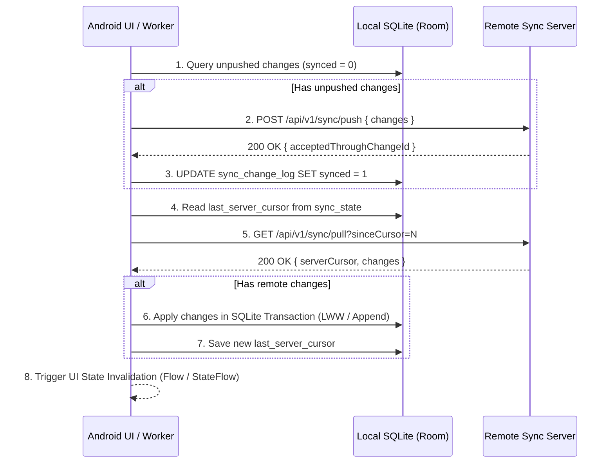

# Phase 5: Android Background Sync Client & Jetpack WorkManager

> **Parent Roadmap**: [ANDROID_APP_INTEGRATION_AND_SYNC.md](../../ANDROID_APP_INTEGRATION_AND_SYNC.md)  
> **Target Subsystem**: Android Client Sync Engine & WorkManager  

---

## 🎯 Phase Objective
Implement the Android-side sync engine: a robust synchronization client combining immediate foreground sync (on pull-to-refresh or card review) and periodic background synchronization managed by Android Jetpack `WorkManager`, with exponential backoff and network constraint checks.

---

## 🔄 Two-Way Sync Loop Execution Flow



---

## 🛠️ WorkManager Worker Implementation

```kotlin
package com.medha.companion.data.sync

import android.content.Context
import androidx.work.*
import java.util.concurrent.TimeUnit

class MedhaSyncWorker(
    appContext: Context,
    workerParams: WorkerParameters
) : CoroutineWorker(appContext, workerParams) {

    override suspend fun doWork(): Result {
        val syncManager = MedhaSyncManager.getInstance(applicationContext)
        return try {
            val syncResult = syncManager.performFullSync()
            if (syncResult.isSuccess) {
                Result.success()
            } else {
                if (runAttemptCount < 3) Result.retry() else Result.failure()
            }
        } catch (e: Exception) {
            if (runAttemptCount < 3) Result.retry() else Result.failure()
        }
    }

    companion object {
        fun enqueuePeriodicSync(context: Context) {
            val constraints = Constraints.Builder()
                .setRequiredNetworkType(NetworkType.CONNECTED)
                .build()

            val syncRequest = PeriodicWorkRequestBuilder<MedhaSyncWorker>(15, TimeUnit.MINUTES)
                .setConstraints(constraints)
                .setBackoffCriteria(BackoffPolicy.EXPONENTIAL, 30, TimeUnit.SECONDS)
                .build()

            WorkManager.getInstance(context).enqueueUniquePeriodicWork(
                "MedhaPeriodicSync",
                ExistingPeriodicWorkPolicy.KEEP,
                syncRequest
            )
        }
    }
}
```

---

## 🧪 Verification Gate
- Unit tests verify the sync loop: local mutations push successfully, remote changes merge deterministically without duplicate rows.
- WorkManager schedules without crashing on battery/network constraints.
