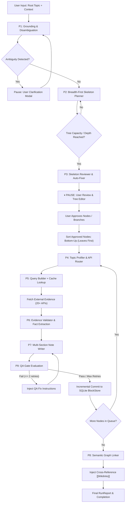

# Medha (मेधा) AI Note-Making Pipeline Architecture

## 1. Executive Summary & Core Philosophy

Medha is designed as an **offline-first, private-first Personal Knowledge Management (PKM) and cognitive learning platform** combining block-based notes, an infinite spatial canvas, interactive handwriting, and FSRS spaced repetition.

A foundational capability of Medha is its **Autonomous AI Note-Making Pipeline** (`AutoNotePipelineService.swift`, `MasterPlanService.swift`, and desktop `autoNotePipeline.js`). Unlike conventional AI note apps that simply prompt an LLM for an unstructured wall of text, Medha treats note creation as a **formal multi-phase compilation pipeline**:

```
           ┌────────────────────────────────────────────────────────┐
           │                     USER TOPIC                         │
           └──────────────────────────┬─────────────────────────────┘
                                      │
                         [P1] Grounding & Disambiguation
                                      │
                         [P2] Breadth-First Skeleton Planning
                                      │
                         [P3] Structural Review & Audit
                                      │
                 ⏸ PAUSE: Human-in-the-Loop Tree Review & Edits
                                      │
                         [P4] Multi-API Evidence Router
                                      │
                         [P5] Query Builder & Cache
                                      │
                         [P6] Evidence Validation & Fact Scorer
                                      │
                         [P7] Multi-Tier Note Writer
                                      │
                         [P9] QA Gate & Automated Healing (Retry Loop)
                                      │
                         [P8] Conceptual Graph Linker ([[Wikilinks]])
                                      │
                         Incremental SQLite BlockStore Commit
                                      │
           ┌──────────────────────────▼─────────────────────────────┐
           │        STRUCTURED, VERIFIED HIERARCHICAL KNOWLEDGE      │
           └────────────────────────────────────────────────────────┘
```

### Key Architectural Invariants
1. **Zero Hallucination & Fact Grounding**: Every factual assertion must be grounded in verified academic or encyclopedic APIs (Wikipedia, Wikidata, OpenAlex, PubMed, arXiv, etc.). Claims originating solely from LLM parametric memory are explicitly flagged as `[unverified]`.
2. **MECE Structural Hierarchy**: Note trees must be **Mutually Exclusive, Collectively Exhaustive** (MECE). Children cover the parent's conceptual space with zero semantic overlap between siblings.
3. **Strict Ban on Generic Meta-Placeholders**: Titles such as *"Overview"*, *"Introduction"*, *"Basics"*, *"Mechanics"*, or *"Applications"* are programmatically forbidden. Every note title must be a **content-representative noun phrase** explicitly naming the concrete mechanism, substance, theorem, algorithm, or event (e.g., *"Microtubule Polymerization & Kinetochore Tension"* instead of *"Mechanisms"*).
4. **Human-in-the-Loop Agency**: The pipeline automatically pauses after skeleton generation, giving the learner complete editorial authority to rename, reparent, add, delete, or lock nodes prior to content synthesis.
5. **Local-First & Multi-Provider Flexibility**: 100% functional offline using local models via Ollama/LM Studio (e.g., Qwen 2.5 1.5B, DeepSeek-R1 1.5B, Llama 3.2 3B) while supporting cloud engines (Google Gemini, OpenAI, Groq) with independent configuration for Notes vs. Flashcards.
6. **Crash-Resilient Incremental Persistence**: Notes and structural outlines are committed to Medha's SQLite database (`GRDB`) incrementally. Skeletal markers ensure instant outline availability even before content synthesis begins.

---

## 2. Note & Document Hierarchy Architecture

Medha's data layer models notes as a strict two-level hierarchy in SQLite:

```
Notebook (nb_*)
   └── Root Document (doc, parentId = nil)
         ├── Child Document (doc, parentId = rootDoc.id)
         │     ├── Child Document (doc, parentId = childDoc.id) [Level 2..N]
         │     │     ├── Block 0 (heading1)
         │     │     ├── Block 1 (callout)
         │     │     ├── Block 2 (paragraph)
         │     │     └── Block 3 (codeBlock)
         │     └── Content Blocks ...
         └── Content Blocks ...
```

### 2.1 The Two Fundamental Entities
In Medha (`Block.swift`):
1. **Document (`BlockType.doc`)**: Represents a note page in the sidebar tree. It stores `parentId` to form nested document trees. When a document is created, its `rootDocId` equals its own `id`.
2. **Content Blocks**: Content elements belonging to a specific document. A block has `rootDocId` pointing to its containing Document and `parentId` pointing to either the Document or a parent block (for nested toggles/lists).

| Field | Purpose in Hierarchy |
| :--- | :--- |
| `id` | Unique UUID (`b_...` or `doc_...`) |
| `rootDocId` | Points to the Document containing this block |
| `parentId` | For documents: points to the parent Document. For blocks: points to parent block or doc |
| `type` | `.doc`, `.heading1`, `.heading2`, `.heading3`, `.paragraph`, `.bulletList`, `.taskList`, `.codeBlock`, `.quote`, `.callout`, `.table`, `.toggle`, `.blockRef` |
| `content` | Plain text or markdown content of the block |
| `sortOrder` | Integer controlling vertical sequence within the parent |

### 2.2 Skeletal Notes vs. Filled Notes
When the pipeline creates a hierarchy, it instantly persists **Skeletal Documents** into SQLite:
```swift
// Skeletal root/child marker inserted during Step 1
let skeletalBlock = Block(
    id: Block.generateId(),
    rootDocId: childDocId,
    parentId: childDocId,
    type: .quote, // or .callout
    content: "🪄 Skeletal Note • Scope: \(node.scope_note)",
    sortOrder: 0
)
```
This guarantees that:
- The entire multi-tiered curriculum appears in the sidebar tree within 1–2 seconds.
- If network drops or the user navigates away, the structure is completely preserved.
- Any skeletal document can be filled on-demand later via the single-note synthesis action (`fillSingleDocument`).

---

## 3. The 11-Phase Auto-Note Pipeline (Deep Dive)

The complete autonomous pipeline is orchestrated by `AutoNotePipelineService.swift` and powered by prompt templates in `AutoNotePrompts.swift`.



---

### Phase 1: Grounding & Sense Disambiguation (`P1`)
**Goal**: Ground the root topic in encyclopedic reality before any tree planning occurs.

1. **API Interrogation**: Executes parallel search queries against:
   - `Wikipedia Search API`: Retrieves top encyclopedic match titles and extracts.
   - `Wikidata wbsearchentities API`: Retrieves entity label, description, and unique QID (e.g., `Q8054` for Protein).
2. **Sense Resolution**:
   - Compares search returns against user context.
   - Records `chosen_sense` and explicit `rejected_senses`.
   - Classifies domain (`science`, `medicine`, `stem`, `history`, `philosophy`, etc.), `entity_type` (`concept`, `process`, `structure`, `event`, etc.), and `freshness` (`static`, `slow_changing`, `time_sensitive`).
3. **Disambiguation Gate**: If a topic is polysemous (e.g., "Transformer" = Electrical device vs. Deep Learning architecture) and context is missing:
   - Sets `needs_user_clarification = true`.
   - Generates a targeted question presenting the top 2–3 candidate senses.
   - Pauses the pipeline in `AutoNotePipelinePhase.clarificationNeeded`.

---

### Phase 2: Breadth-First Skeleton Planning (`P2`)
**Goal**: Recursively expand the topic into a balanced, rigorous hierarchy.

1. **Queue-Based BFS Traversal**:
   - Begins at `rootNode` (Level 0).
   - Pops the next unexpanded node from the FIFO queue.
   - Evaluates budget: stops if `tree.count >= max_nodes` (default 120) or node reaches `max_depth` (default 4).
2. **Context-Rich Structural Evidence Gathering**:
   - Level 1: Wikipedia Table of Contents + Wikidata `has_part` / `subclass_of` relations.
   - Level 2: Section sub-headings + OpenAlex/Semantic Scholar topic clusters.
   - Level 3+: In-depth scholarly topic trees and keyword co-occurrences.
3. **Strict MECE Split Principle**: The LLM must select exactly **one** split principle for each generation step:
   - `component`: Structural parts / physical decomposition.
   - `type`: Taxonomical classifications / variants.
   - `method`: Algorithmic steps / procedural phases.
   - `time`: Chronological evolution / developmental stages.
   - `question`: Fundamental pedagogical inquiries.
4. **Content-Representative Title Enforcement**:
   - Hard bans on empty abstractions (*"Overview"*, *"Core Concepts"*, *"Mechanics"*, *"Applications"*).
   - Mandatory inclusion of specific chemical compounds, algorithms, mathematical formulations, anatomical landmarks, or doctrines.
5. **Leaf Test**: If a node's scope can be comprehensively mastered in ~800 words without subtopics, the planner marks `leaf = true` and `children = []`.

---

### Phase 3: Structural Review & Balance (`P3`)
**Goal**: Audit the entire tree outline before presenting it to the user.

1. **Holistic Audit**:
   - Inspects the full tree outline against curated Wikipedia categories and reference taxonomies.
2. **Defect Detection**:
   - **Duplicates / Near-Duplicates**: Detects semantic collision between nodes in different branches.
   - **Overlapping Siblings**: Flags scope notes that intersect.
   - **Unbalanced Branches**: Flags single-child nodes or branches exceeding `max_children` (9).
   - **Missing Subtopics**: Detects omissions of foundational areas.
   - **Generic Titles**: Flags any remaining vague labels.
3. **Automated Healing**:
   - Auto-renames vague titles to concrete mechanism titles (unless locked by user).
   - Attaches `risk_flags` to nodes requiring attention.

---

### ⏸ The User Approval Pause (Human-in-the-Loop)
Once Phase 3 concludes, the pipeline halts with `phase = .waitingUserApproval`:

- **Interactive Tree UI** (`NotesAIAssistantView.swift`): The user inspects the proposed hierarchy as an interactive tree.
- **Node Editing**:
  - Rename title (automatically updates inbound `[[wikilinks]]` across the entire tree).
  - Modify scope note.
  - Adjust target depth (`overview`, `working`, `expert`).
  - Move/reparent nodes.
  - Delete unwanted nodes (automatically appends `"not covered here: <title>"` to the parent's scope note to prevent re-generation).
  - Add custom manual nodes.
- **Field Locking (`user_locked`)**: Any field touched by the user is permanently locked so subsequent AI steps cannot alter it.
- **P10 Branch Regeneration**: The user can click *"Regenerate Branch"* on any subtree. The AI regenerates the branch while strictly avoiding previously rejected titles.
- **P11 Go Deeper**: The user can request deeper sub-branches on any leaf node.
- **Approval Actions**: Individual node approval, branch approval, or *"Approve All & Generate"*.

---

### Phase 4: Topic Profiling & Multi-API Router (`P4`)
**Goal**: Match each node to the optimal academic and empirical knowledge sources.

The router evaluates each approved node:
1. **Entity-to-API Mapping**:
   - *Biology / Medicine / Substances*: Wikipedia + PubMed (NCBI) + Europe PMC.
   - *Math / Computer Science / Physics*: Wikipedia + arXiv + OpenAlex.
   - *Philosophy / Humanities / History*: Wikipedia + OpenAlex + Open Library.
   - *Linguistics / Terms*: Wiktionary + Free Dictionary + Wikipedia.
   - *Software / Engineering*: Stack Exchange + GitHub + Official Docs.
   - *Statistics / Economics*: World Bank + Wikipedia.
2. **Call Budgeting**:
   - Standard depth: Up to 6 API calls.
   - Expert depth: Up to 10 API calls, with mandatory inclusion of peer-reviewed surveys.
3. **Fallback Chain**: Formulates graceful fallback (e.g., `[PubMed -> Europe PMC -> OpenAlex -> Wikipedia -> UNVERIFIED]`).

---

### Phase 5: Parameterized Query Builder & Cache (`P5`)
**Goal**: Translate planned steps into precise HTTP query parameters without duplicates.

- Normalizes queries to lowercase trimmed keys `(api, normalized_query)`.
- Reuses cached responses across sibling and descendant nodes.
- For scholarly APIs, constructs two distinct queries:
  1. *Foundational query*: Highly cited seminal works.
  2. *Contemporary review query*: Surveys published within the last 5 years.

---

### Phase 6: Evidence Validation & Fact Scorer (`P6`)
**Goal**: Filter raw API responses into validated, scored evidence items.

1. **Sense Verification**: Confirms the result discusses the exact intended sense. Discards irrelevant results immediately.
2. **Triple-Metric Scoring**:
   - Relevance (0–3) + Authority (0–3) + Recency (0–2).
   - If `total_score < 4`, the result is discarded.
3. **Fact Extraction**:
   - Extracts up to 8 paraphrased key claims.
   - Hard constraint: Never copies more than 12 consecutive words from source text.
4. **Contradiction Tracking**:
   - Checks claims against previously accepted evidence.
   - Marks discrepancies with `conflicts_with: <evidence_id>`. Contradictions are preserved so the writer can present both viewpoints.

---

### Phase 7: Multi-Tier Note Writer (`P7`)
**Goal**: Synthesize rich, pedagogically structured Markdown grounded exclusively in evidence.

#### Bottom-Up Filling Order
The pipeline fills nodes **bottom-up (leaves first)**:
- Leaf nodes are written first using deep empirical evidence.
- Parent notes are synthesized later, allowing them to summarize and link to their fully realized children with 100% precision.

#### Standard Pedagogical Note Structure
Every note is generated using this uniform, rigorous anatomy:

```markdown
# <Concrete Mechanism Title>
> One-sentence definitive axiom.

## Executive Summary & Core Takeaway
3–6 plain-language sentences capturing the core essence.

## Core Explanation: Detailed Mechanisms, Principles & Dynamics
Scaled by depth (Overview: 250-400w; Working: 500-900w; Expert: 1000w+).
Explains underlying mechanics, formulas, causality, with descriptive ### subheadings.

## Essential Terminology & Distinctions
Glossary of critical terms and non-obvious nuances.

## Concrete Demonstrations & Case Applications
Worked examples, mathematical derivations, code blocks, or clinical case studies.

## Systemic Context & Interdependencies
Parent, siblings, prerequisites represented as [[wikilinks]].

## Granular Subtopics
One line per child note, linked via [[wikilinks]].

## Contested Perspectives & Empirical Uncertainties
Contrasting source positions, open academic questions, and unresolved boundaries.

## Key Literature & Scholarly References
3–5 foundational papers/books with author, year, DOI link, and significance.

## Verified Citation Sources
Exact APIs queried, retrieval dates, and source URLs.

## Active Recall & Self-Assessment Questions
3–5 high-yield conceptual questions answerable from this note.
```

At the conclusion of the note, the model outputs a fenced JSON metadata block (`WriterOutputMetadata`) detailing confidence level, word count, unsupported claims, and evidence IDs used.

---

### Phase 9: Strict QA Gate & Automated Healing (`P9`)
**Goal**: Mechanically evaluate the synthesized note before committing it to disk.

The QA Gate tests the output against 8 failure codes:
- **F1**: Factual claim lacking evidence support not tagged `[unverified]`.
- **F2**: Repetition of parent or sibling content without added depth.
- **F3**: Straying beyond assigned `scope_note`.
- **F4**: Ambiguous terminology used without sense definition.
- **F5**: Evidence conflicts omitted from the "Contested Perspectives" section.
- **F6**: Word count beneath depth minimums.
- **F7**: Padded generic prose unsupported by evidence.
- **F8**: User-locked fields modified.

**Self-Healing Loop**: If the note fails QA:
1. `QAGateOutput` produces precise diagnostic `fix_instructions`.
2. The pipeline invokes P7 Note Writer again, passing `qaFixInstructions` as mandatory override directives.
3. Allows up to `writer_retries` (default: 2 retries). If still failing, note is committed as `.needs_review` with low confidence.

---

### Phase 8: Semantic Graph Linker (`P8`)
**Goal**: Synthesize non-hierarchical lateral connections across the note graph.

Once all nodes are filled:
1. The linker evaluates all note scopes, entity types, and Wikidata QIDs.
2. Identifies non-tree cross-links (ignoring direct parent/child/sibling relationships).
3. Assigns explicit relation semantics:
   - `prerequisite`
   - `contrast`
   - `application`
   - `example_of`
   - `related`
4. Injects bidirectional markdown cross-references:
   ```markdown
   ### Related Concepts
   - [[CRISPR-Cas9 Base Editing]] (application): Extends double-strand break repair mechanics.
   ```
5. These links automatically populate Medha's **Interactive Knowledge Graph View** (`GlobalGraphView.swift`, `LocalGraphView.swift`).

---

## 4. Multi-Source Grounding Catalog (20+ Knowledge APIs)

Medha contains a built-in network dispatcher (`AutoNoteAPICatalog.swift`) that connects to verified academic and open-knowledge databases with zero API keys required for core sources:

| Source API | Category | Primary Use Case |
| :--- | :--- | :--- |
| **Wikipedia** | Encyclopedic | Conceptual definitions, section TOC outlines, introductory summaries |
| **Wikidata** | Structured Knowledge | Semantic IDs (QIDs), property relations (`part of`, `subclass of`) |
| **OpenAlex** | Scholarly Literature | 250M+ peer-reviewed papers, citation counts, concept hierarchies |
| **Semantic Scholar** | Scholarly Literature | AI-generated TLDR summaries, citation velocity, related papers |
| **PubMed (NCBI)** | Biomedical & Clinical | Peer-reviewed medical journals, clinical trials, biological abstracts |
| **Europe PMC** | Biomedical Literature | Open-access life sciences literature and European PMC full-text |
| **arXiv** | STEM Preprints | Preprints in physics, mathematics, computer science, quantitative biology |
| **CrossRef** | Metadata & DOIs | Canonical DOI resolution, journal publication metadata |
| **Open Library** | Books & Monographies | Library catalogs, editions, monographs, historical publications |
| **Gutendex** | Classic Literature | Project Gutenberg full-text primary literature |
| **Wiktionary** | Lexicography | Terminology, etymological roots, morphological definitions |
| **Free Dictionary** | Lexicography | Standard definitions, phonetics, parts of speech |
| **World Bank** | Macroeconomics | Global economic indicators, development statistics, temporal metrics |
| **Nominatim (OSM)** | Geospatial | Geographic coordinates, regional hierarchies, boundary taxonomies |
| **GitHub API** | Software & Code | Open-source implementations, repository stars, language breakdowns |
| **Stack Exchange** | Practical Engineering | High-voted technical explanations, code pitfalls, edge cases |
| **NASA Open API** | Space & Earth Science | Planetary data, space missions, astronomical observations |
| **Met Museum API** | Art History | Cultural heritage artifacts, provenance, historical artwork records |
| **Web Search** | Dynamic Fallback | Fresh news, real-time events (Brave / Tavily / Serper fallback) |

---

## 5. Dual-Config AI Model Architecture & Local Execution

Medha provides full independence between different AI features in the app (`AISettings.swift`):

```
                        ┌───────────────────────────────────────────┐
                        │              AI SETTINGS                  │
                        └─────┬───────────────────────────────┬─────┘
                              │                               │
             ┌────────────────▼───────────────┐ ┌─────────────▼───────────────┐
             │       NOTES AI ASSISTANT       │ │     FLASHCARD SOCRATIC      │
             │   (Hierarchy & Synthesis)      │ │   (Interactive Tutoring)    │
             ├────────────────────────────────┤ ├─────────────────────────────┤
             │ • Mode: Google Gemini / Cloud  │ │ • Mode: Local Ollama / 1.5B │
             │ • Model: gemini-2.5-flash      │ │ • Model: qwen2.5:1.5b       │
             │ • Goal: Multi-source synthesis │ │ • Goal: Zero-latency review │
             └────────────────────────────────┘ └─────────────────────────────┘
```

### 5.1 Local AI Setup (Ollama / Metal GPU)
Medha can operate completely offline with zero data leakage:
- **Default Engine**: [Ollama](https://ollama.com) via `http://localhost:11434/v1` (OpenAI-compatible endpoint).
- **Supported Local Frameworks**: Ollama, LM Studio (port 1234), `llama.cpp` (`llama-server` on port 8080).
- **Recommended Models**:
  - `qwen2.5:1.5b` (Fastest, ultra-sharp JSON formatting, runs on 4 GB RAM).
  - `deepseek-r1:1.5b` (Deep analytical reasoning; Medha strips `<think>...</think>` internal tokens automatically).
  - `llama3.2:3b` (Balanced reasoning and explanation quality).
  - `qwen2.5:7b` / `mistral:7b` (High-tier multi-document synthesis for 16 GB+ Macs).

### 5.2 Parameter-Aware Context Budgeting
To ensure high reliability across both tiny 1.5B local models and large 70B+ cloud models:
- **1.5B–3B Models**: Evidence excerpts are budgeted to ~400–500 concise characters per source. Prompts enforce strict single-object JSON outputs to prevent memory overflow or hallucinated syntax.
- **7B+ & Cloud Models**: Rich multi-paragraph abstracts and detailed citation metadata are supplied for exhaustive comparative analysis.

---

## 6. Alternative Synthesis Workflows

In addition to the 11-phase autonomous pipeline, Medha supports two complementary workflows:

### 6.1 On-Demand In-Node Content Fill (`fillSingleDocument`)
When a user generates a skeletal tree (or manually creates an outline), they can fill individual documents on demand:
1. User opens any skeletal note.
2. Clicks **"Synthesize Note"** in the toolbar or AI panel.
3. The engine inspects the document's ancestry, siblings, and scope note directly from `BlockStore`.
4. Executes Phases P4 (Router) $\rightarrow$ P5 (Query Builder) $\rightarrow$ P6 (Validator) $\rightarrow$ P7 (Writer) $\rightarrow$ P9 (QA Gate).
5. Converts generated Markdown into native blocks and writes them to SQLite without modifying surrounding documents.

### 6.2 The Deep Master Plan / Syllabus Monograph System (`MasterPlanService.swift`)
Designed for university-level monograph curriculum generation:
- **Archetypes**:
  - *Academic Master Monograph*: Theoretical rigor, axiomatic proofs, etymological depth.
  - *Pragmatic Worked Examples & Tables*: Interlinear glosses, syntax tables, step-by-step problem walkthroughs.
  - *Comprehensive Technical Reference*: System specifications, memory layouts, algorithmic matrices, failure modes.
- **Workflow**:
  1. Formulates a cohesive multi-chapter syllabus from encyclopedic grounding.
  2. Presents syllabus preview for chapter reordering, editing, or addition.
  3. Sequentially synthesizes each chapter with live progress reporting.
  4. Automatically creates a dedicated parent document and nested chapter notes.

---

## 7. Pipeline Data Structures & Schemas Reference

The core data structures are defined in `AutoNoteSchemas.swift`:

### `NoteNodeRecord`
```swift
public struct NoteNodeRecord: Codable, Sendable, Identifiable {
    public var id: String                  // e.g., "n_0001"
    public var parent_id: String?          // Parent node ID
    public var level: Int                  // Hierarchy depth (0 = root)
    public var title: String               // Content-representative noun phrase
    public var scope_note: String          // What is covered vs. left to siblings
    public var why: String                 // Rationale for placement under parent
    public var split_principle: String     // component | type | method | time | question
    public var entity_type: String         // concept | process | structure | event
    public var expected_depth: String      // overview | working | expert
    public var leaf: Bool                  // True if no further sub-notes needed
    public var reading_order: Int          // Optimal pedagogical sequence
    public var prerequisites: [String]     // Required prior knowledge nodes
    public var source_support: [String]    // ["wikipedia_toc", "openalex", etc.]
    public var confidence: String          // high | medium | low
    public var risk_flags: [String]        // Warnings from Phase 3 review
    public var user_locked: [String]       // Fields protected from AI modification
    public var status: NodeStatus          // proposed | edited | approved | filling | filled
    public var markdown_content: String?   // Synthesized markdown text
}
```

### `EvidenceItem`
```swift
public struct EvidenceItem: Codable, Sendable, Identifiable {
    public var evidence_id: String         // e.g., "e_0001"
    public var api: String                 // "wikipedia", "pubmed", "openalex", etc.
    public var query: String               // Exact query string used
    public var retrieved_at: String        // ISO8601 timestamp
    public var url_or_id: String           // Source DOI, PMID, or URL
    public var source_kind: String         // primary | secondary | tertiary
    public var sense_matches: Bool         // Verified sense alignment
    public var content_summary: String     // Paraphrased extract (< 120 words)
    public var key_facts: [KeyFact]        // Verified factual claims
    public var score: EvidenceScore        // Relevance + Authority + Recency
    public var discard: Bool?              // True if rejected by validator
}
```

### `RunReport`
```swift
public struct RunReport: Codable, Sendable {
    public var root_id: String
    public var nodes_total: Int
    public var nodes_filled: Int
    public var unverified: [String]        // Nodes containing ungrounded claims
    public var low_confidence: [String]     // Nodes with thin evidence
    public var failed: [String]            // Nodes that encountered execution errors
    public var api_calls: [String: Int]    // Call counts by API service
    public var cache_hits: Int             // Number of cached API queries reused
    public var user_edits: Int             // Count of manual user modifications
    public var needs_attention: [AttentionItem] // Unresolved QA issues
}
```

---

## 8. Summary & Technical Invariants Checklist

When working on or extending the note-making pipeline, verify compliance with these architectural rules:

- [x] **No Generic Placeholders**: Ensure all generated titles explicitly name concrete entities or mechanisms.
- [x] **Strict Downward Hierarchy**: Documents must maintain unambiguous parentage (`childDoc.parentId = parentDoc.id`).
- [x] **Incremental Persistence**: Skeletal blocks must be written to disk immediately to survive unexpected exits.
- [x] **Clean Sanitization**: Strip `<think>` reasoning tokens from reasoning models (DeepSeek-R1 / QwQ) before JSON parsing.
- [x] **Lock Preservation**: Never overwrite any node property present in `node.user_locked`.
- [x] **Link Parity**: When a user or system renames a node, automatically rewrite all `[[Old Title]]` references to `[[New Title]]` across the note tree.
- [x] **Bottom-Up Synthesis**: Always synthesize child notes before parent notes so summaries and cross-links reflect finalized child content.
